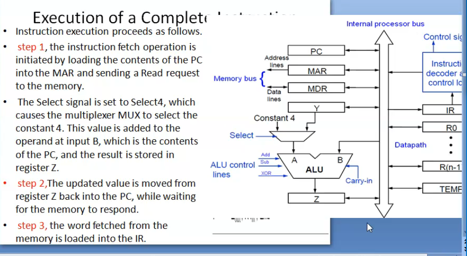
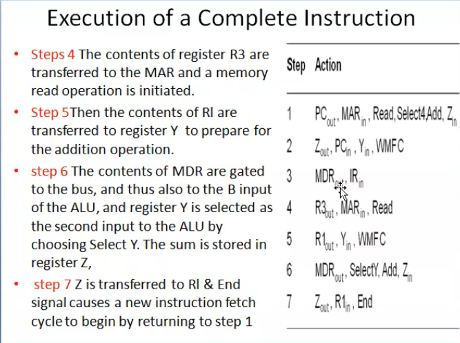
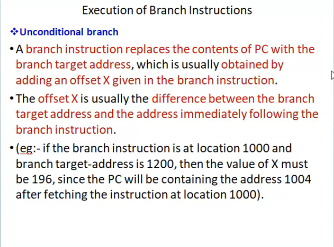

# Ppt has better exp
------
[https://drive.google.com/drive/folders/1vAPPx_LsJssjKtoQO63IRZluWSL9J0gq](COA drive)

## Execution of a complete Instruction

Add (R3),R1

- Fetch the instruction
- fetch the first operand

1. PC out, MAR in, READ, SELECT 4, ADD,Z in _no 2 out in one step_
2. Z out, PC in, Y in, WMFC | > _no 2 out in one step_
3. MDR out,IR in
4. R3 out, MAR in, READ
5. R1 out, Y in, WMFC
6. MDR out, SELECT Y, ADD, Z in
7. Z out,R1 in,END

## Execution of branch Instruction

Exercise
---

What is the control seq for the exec of the instru 

Add R1,R2 

including the instruction fetch phase (Assume it is a single bus structure)
