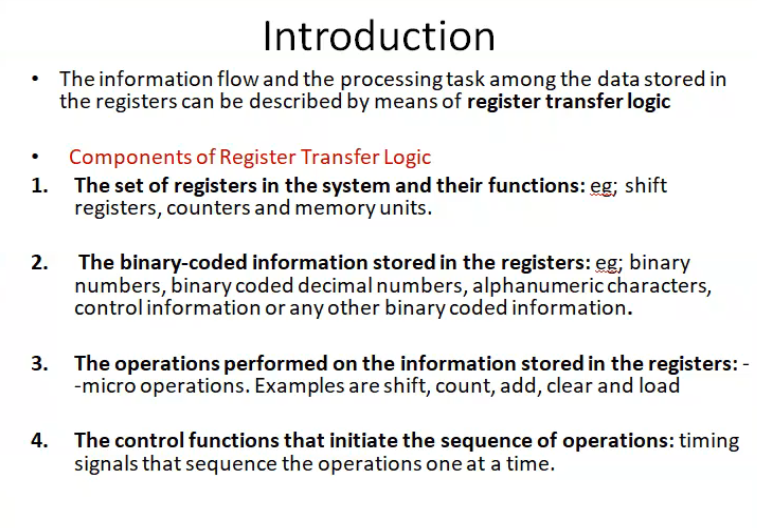

Write the three address, twoaddress and one address repr of the operation beloow with relevant assumptions: C<-[A]+[B]

Ans:

- Add A,B,C

- Add A,B
> MOV B,C

- Load A
> Add B
> Store C

# Module 2

