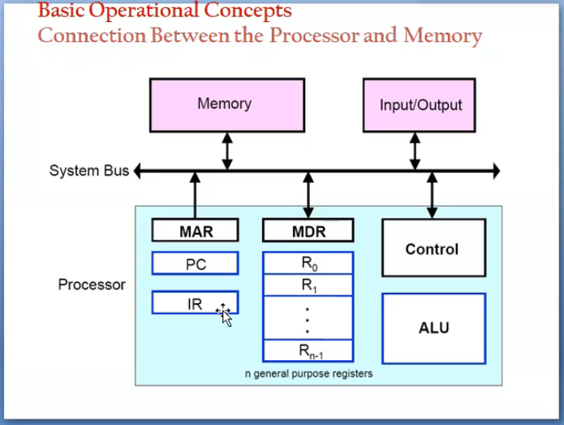
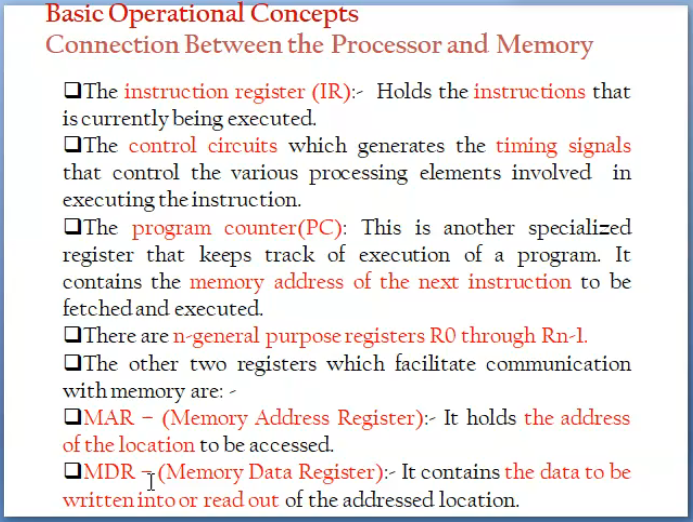

# Basic operational concepts
-conn b/w the processor and memory

individual instructions are brought form the memory into the processor for a specific operation

data to be used as operands are also sotred in the memory

 

 _MAR = memory addr register - holds the addr loc to be accessed_

 _MDR = memory data register - stores the data to read/write an addr_

 _PC = program counter_

 _IR = insrtuction register_

 

operation steps
---
* execute a prog starts when pc is set to point the first instr of the prog

* contents of pc are transfered to MAR

* "read control signal" is sent to the memory

* addr word is read to memory and loaded to MDR

* contents of MDR are transferred to the IR and now decoded and executed

* if it is related to ALU also try to obtain the required operands

* when operand is read it is tranfered to ALU from MDR

* after a couple of repeated cycles the ALU can perform the desired operation

* result sent to MDR

* addr of the location of the result is stored to MAR & write cycle is initiated

* contents of the pc is incremented and points to next instruction/location

the decoded instr are stored to IR

_instru eg:-> add LOCA,R0 = add the value of loca nad r0 and sotre it in r0_

which registeers can interract with the secondary storage- MAR

During the executino of a prog PC is initilised

MAR is connected to Memory
