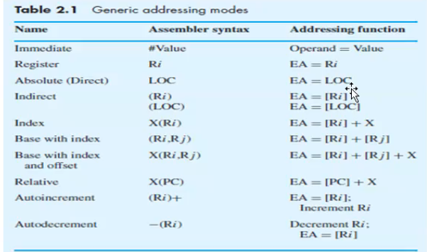
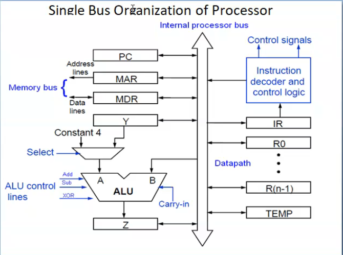

## Registrer Addressing

## Direct/Absolute Addressing

the operand is in a memory location; the address of this location is given explicitly in the instruction.

eg: Move LOC, R2

## Immediate Addressing 

the operand is given explicitly in the instruction
eg: Move #300,R0
> Add #6,R1
> _Effective address = value_

# Indirect Addressing

The Efficitive  address of the oprand is the contents of a register or memory loc whose address appears in the instruction

We denote a indirection by placing the name of register or memory address given in the instruction in parentheses.

The register or memory location contains the address of operand is called a pointer

eg: Add (R1),R0

## Indexed/Displacement Addressing

Index mode - the effective address of the operand is generated by adding a constant value to the contents of a register

index register holds address of a new location and calure of X defines an offset(displacement)

eg: Add 20(R1),R2

> R1+20 is the correct address of the value we need

### Indexing and Arrays

X(Ri) -> Ea = [Ri] + X

(Ri,Rj) -> Ea = [Ri] + [Rj]

X(Ri,Rj) -> Ea = [Ri] + [Rj] + X

### RElative addressing (PC-Relative)

EA is determined by index mode  using the program counter in place of the general purpose register.

eg: X(PC) ; EA = [PC] + X (X is a signed number)

## AutoIncrement mode

The effective address of the oprand is the contents of a register specified in the instruction

After accessing the opteand , the contents of this register are increment automatically
eg: (Ri) -> Ea = Ri

> Increment Ri

## AutoDecrement mode

Contents of a register specified in the instruction is automatically decremented and used as effective address of the operand

(Ri) -> Decrement Ri

> Ea = Ri

# Basic Processing Unit

## Executing an Instruction

### Fetch Phase

Fetch the contents of the memory location pointed to by the PC.The contents of this location are loaded into the IR.

### Exeecution Phase

Executes the instruction in the IR

### Single Bus Organization

MDR has 2 input and 2 output

MAR- input[ processpr bus to MAR ] and 2 output

Control signals - controll all the operation , connected to the memory bus

General Purpose Registers [R0, ... R(n-1)]

Y,Z,Temp -store value

img 2 

Ri out is set ot 1 -> out is possble
Rj in is set to 1 -> input is possible 

