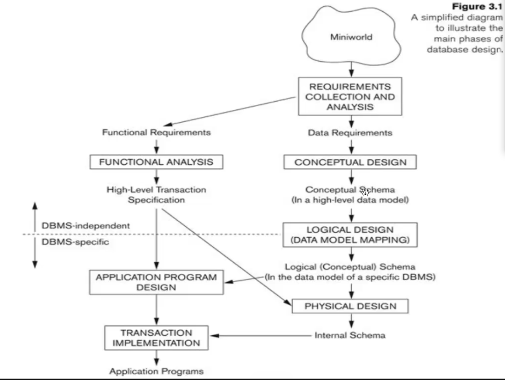
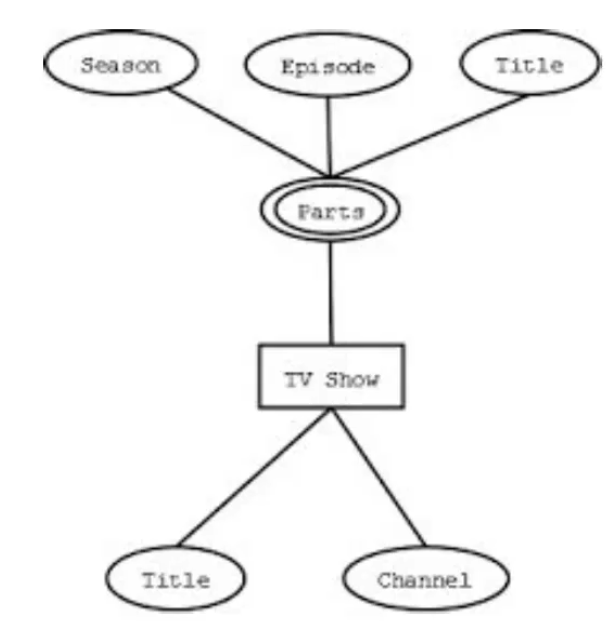
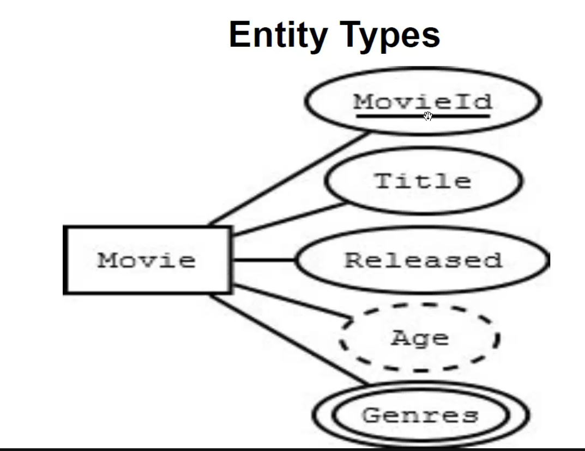

## database design process
------------------
two main activities:
 
- database design
 
- applications design

database design : to design the conceptual schema for a database app

  
_conceptual design: view of the collected data is seperated_
 
_logical design: logical model/rows in the database is created_

## Er model [entity representation model]
--------------------------------------
pictorial rep of database

high lvl conceptual data model

used for conceptual data design of database

easy to understand for non technical users

### ER model concepts
entity/entity type: any real world object are entuty

eg: EMPLOYEE, DEPARMENT, PROJECT, COLLAGE, etc(ALWAYS IN CAPITAL)(table name
in sql)

entity type: property of the entity is the entity attributes

entity set: set of entities which is stores in hte table is the entity set

#### entity type/attribute
domain: allowed or permitted value in the attribute (char[20],int less than 25, )

_ENTITY is repr by rectangle_

_Attributes is repr by oval_

## Type of Attributes
-----------------
### simple attribute
attributes which cannot be further divided

eg:city,age,state,et

### composite attr
it can be composed of several components 

eg: address(house,street,city,state,zip,country), fullname(first,middle,last)

### multi-valued attr
an entity may have multiple valiues for that attr.

repr by double oval

 

### complex attr
combi of composite and multi-valued attr

eg: {degree(college,year,degree,field)}

### key attr
attr which is unique to an entiyt is called key attr.

repr as underline in ER diagram

Stored vs derived attr
----------------------
attr which can be calculated from another attr

eg:age form DOB dateofbirth

repr as dotted line

