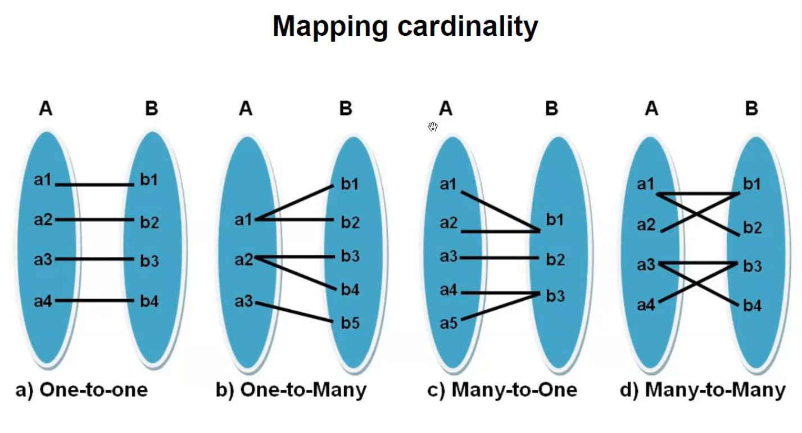

# 1. Entity
# 2. Attribute
# 3.Relationsship
------------
A __relationship__ relates two or more distinct entities with a specific meaning

relationonships of the same type are grouped or typed into a __relationship type__

### Relationship type
* itis a schema descriptionof a relationship 
* Identifies the relaionship name and the participationg 

### Relationship set
* [add something here]

_the degree of a relationship type is the number of participating entity types (if degree is 2 its a binary relationship)_

## Mapping cardinality - 1:1

One entiy in the first entity type is connected to only one entity in the second entity type

### 1:N
one entity in the first entity type is connected to N entities in the second entity type

### N:1
N entities in the first enitty type is connected to 1 entity in the second entity type.

### N:N
N entites in the first entity is connectes to N entities in the second entity type

eg: any number of Employees can work for any number of Projects

## RElations in ER diagram
in ER diagram,
* diamond shaped box is used to represent the Relationship
* max degree posible is 4
* * 2- binary
* * 3- ternary
* * 4- quaternary

