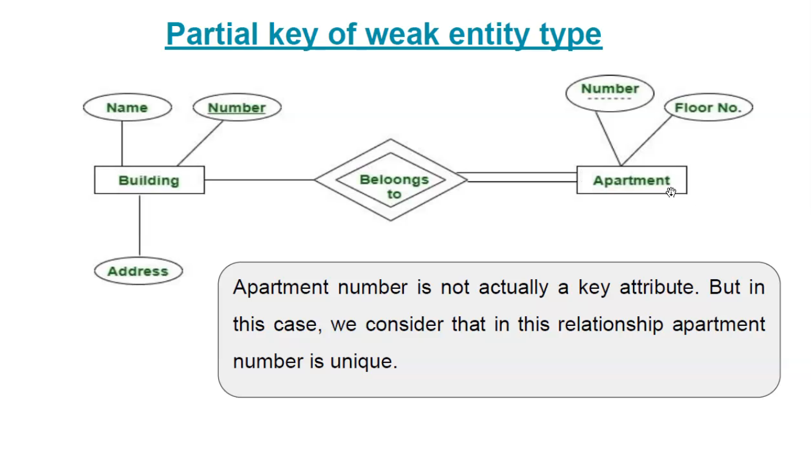
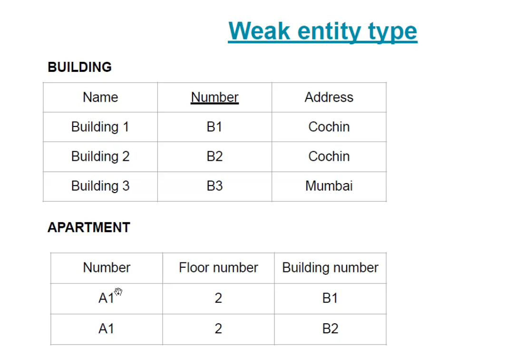

##Topics

- Weak entity type/ strong entity type

- identifying relationship

- weak enitty in ER diagram

- Partial key

- Recursive relationship

### Weak Entity type

Entity type which does not have a key attribute is called Weak entity type.

it is represented by double rectangle

Payment no is not a key attr but it is assumed to be unique and is therefore a partial key.
Always partial key is assosicated with weak entity

It does not have a key attr

A week entity must participate in an identifying relationship type with an owner or identifying entity type

entities are identitified by the  combination of: 

1. a partial key of the weak entity type
2. the strong entitytype which is connected to the weak entity

### Recursive Relationship

