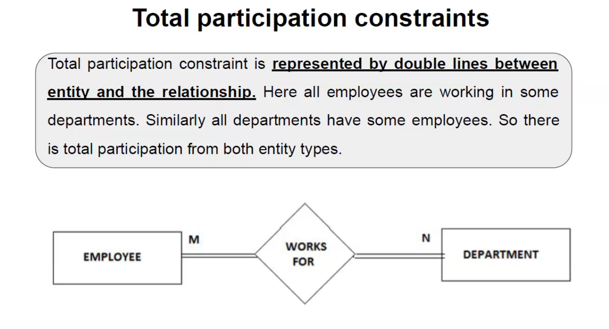
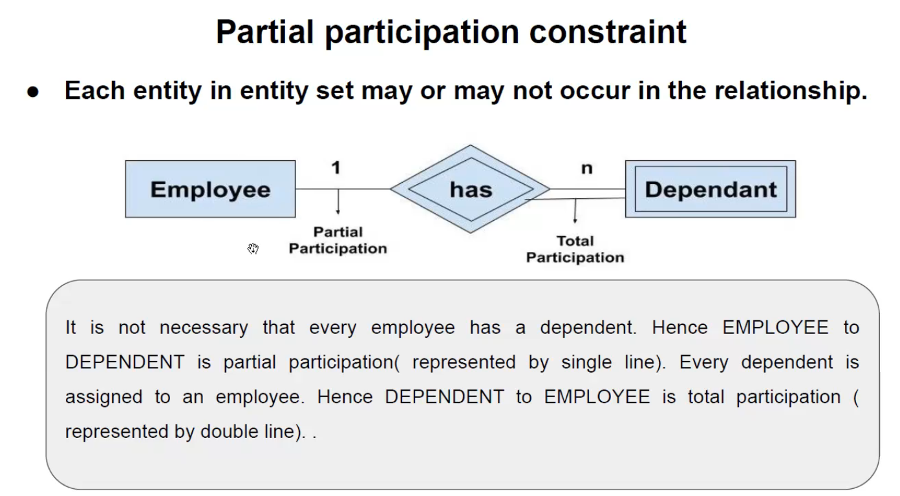
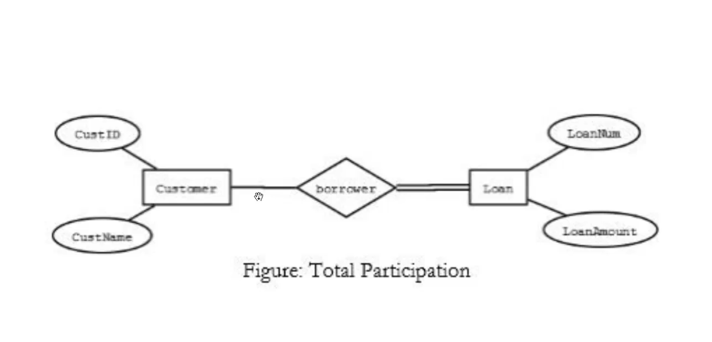
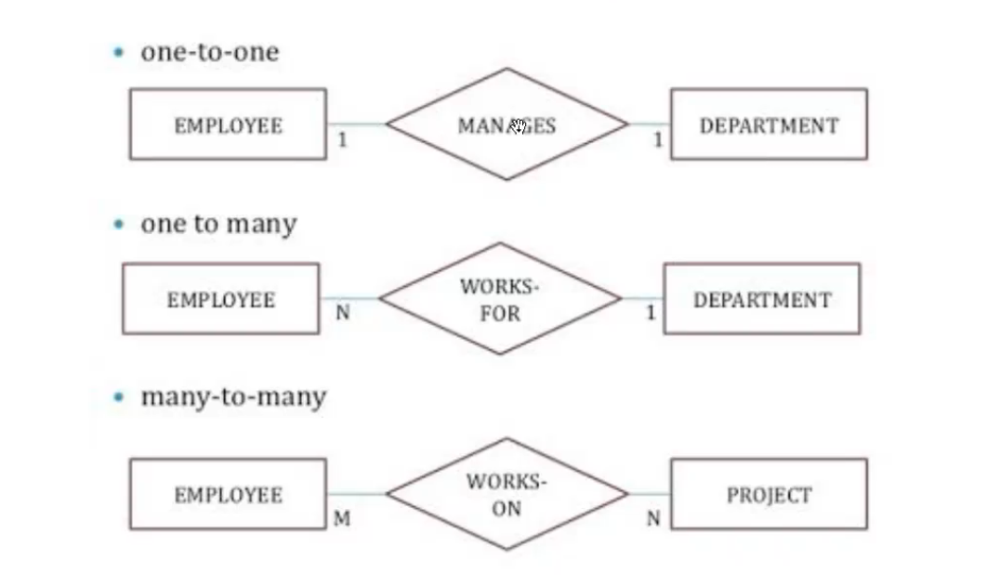
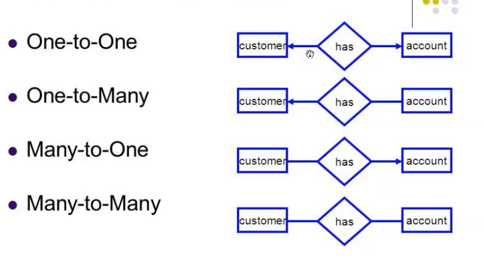
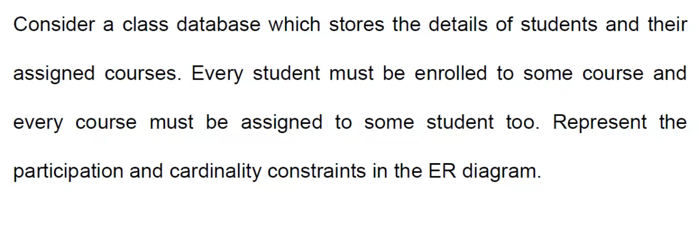
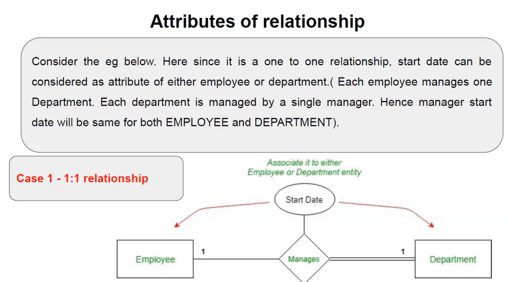
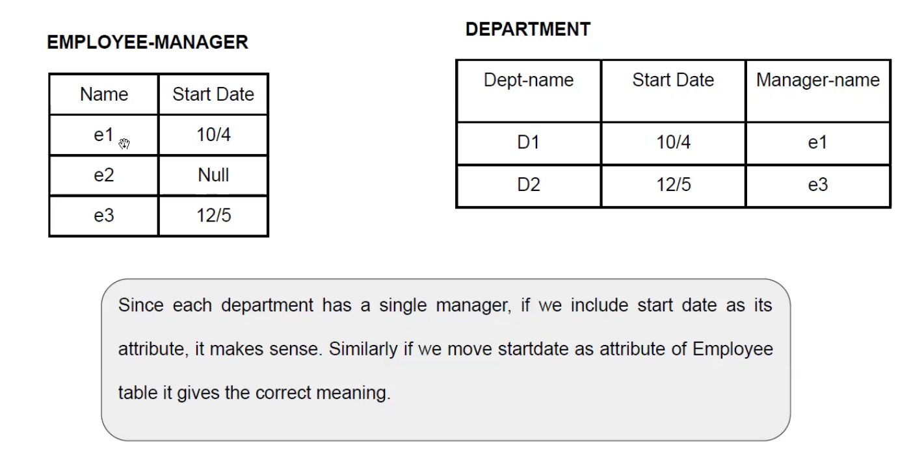
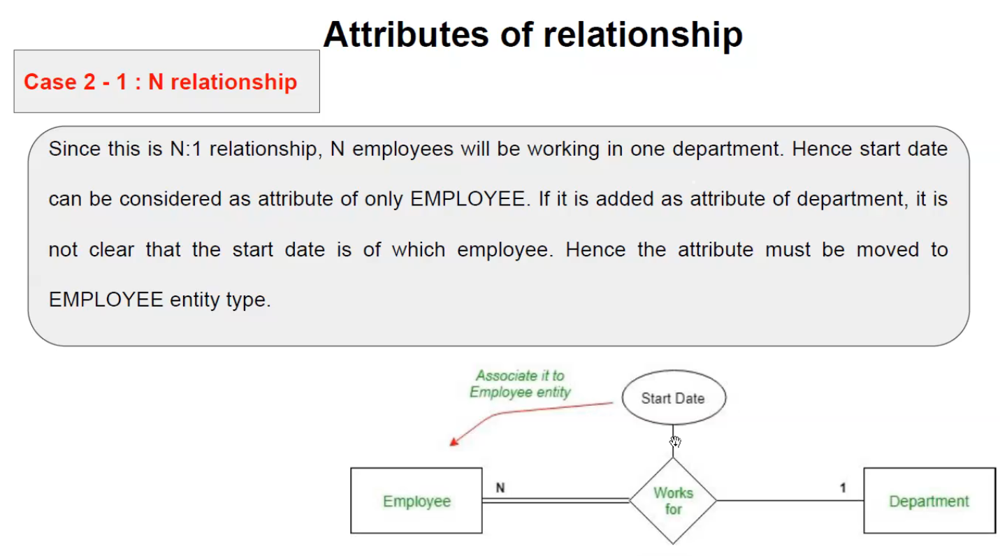
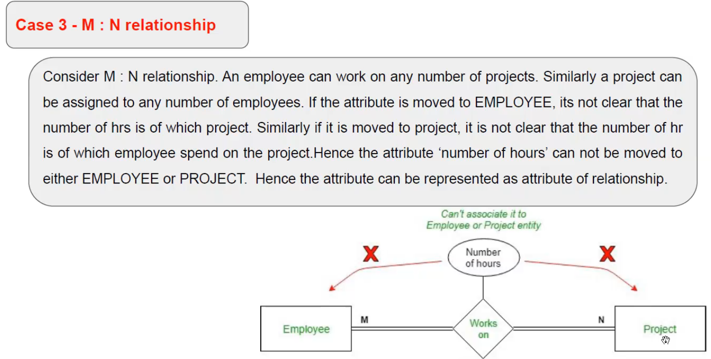

Constrains
----------

- Total participations constrains

All entities in the entity type are involved in the relationship

It is repr by double lines btw entity and the relationship.

- Partial participation constraint

### Example

## Mapping Cardinality in ER Diagram

### Example 2

## Attributes of relationship

### Case 1

### Case 2

### Case3

