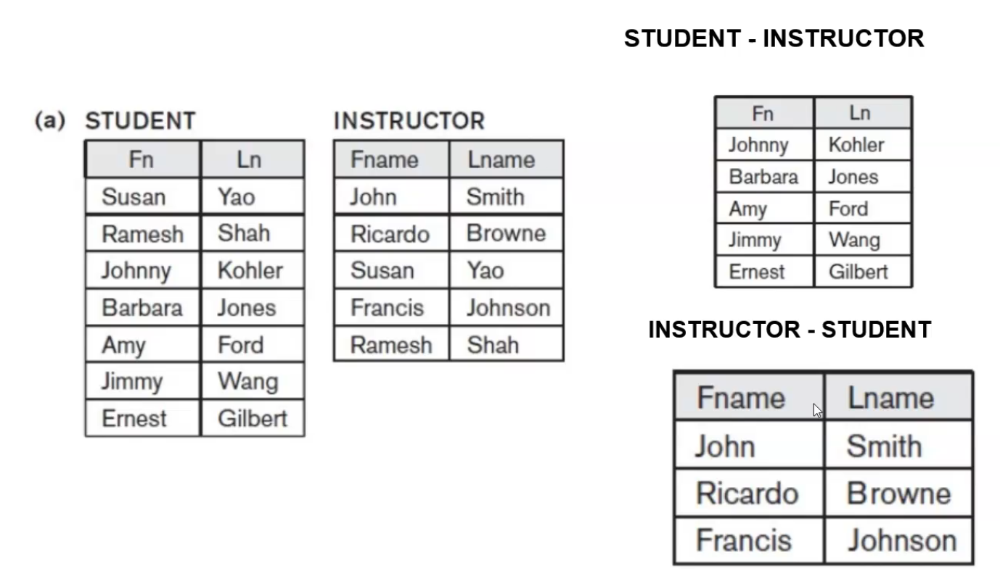
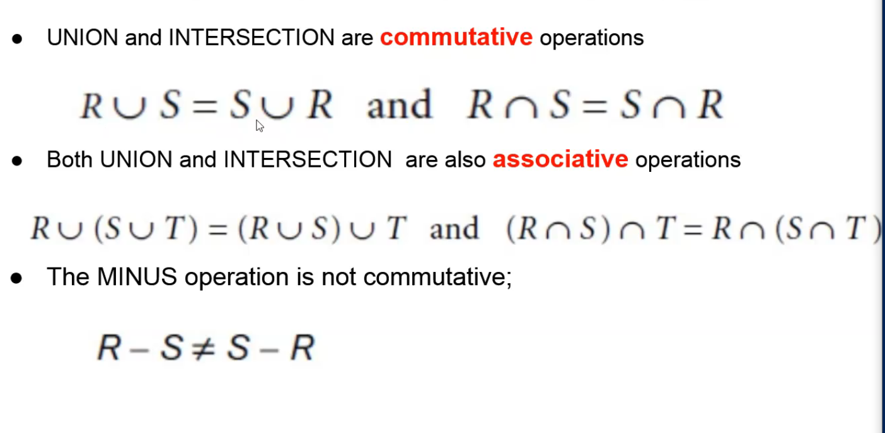
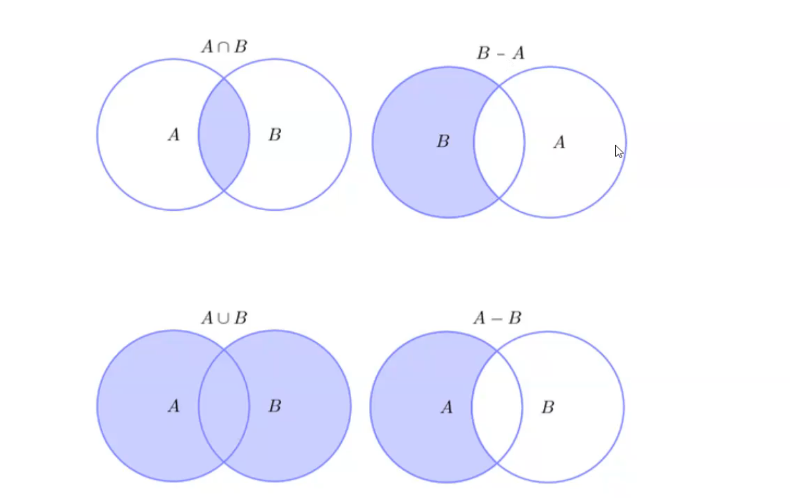
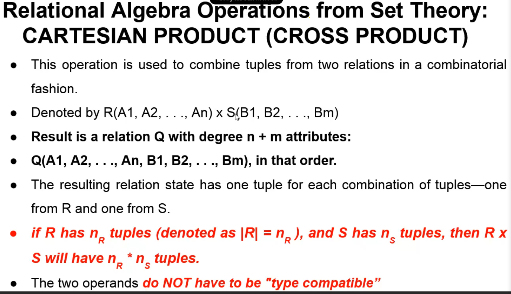
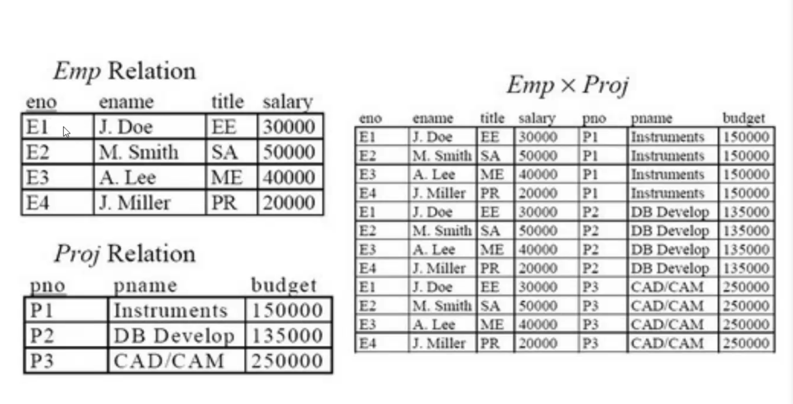
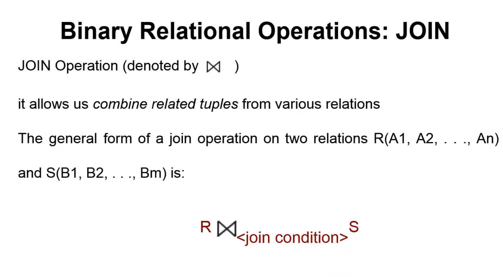
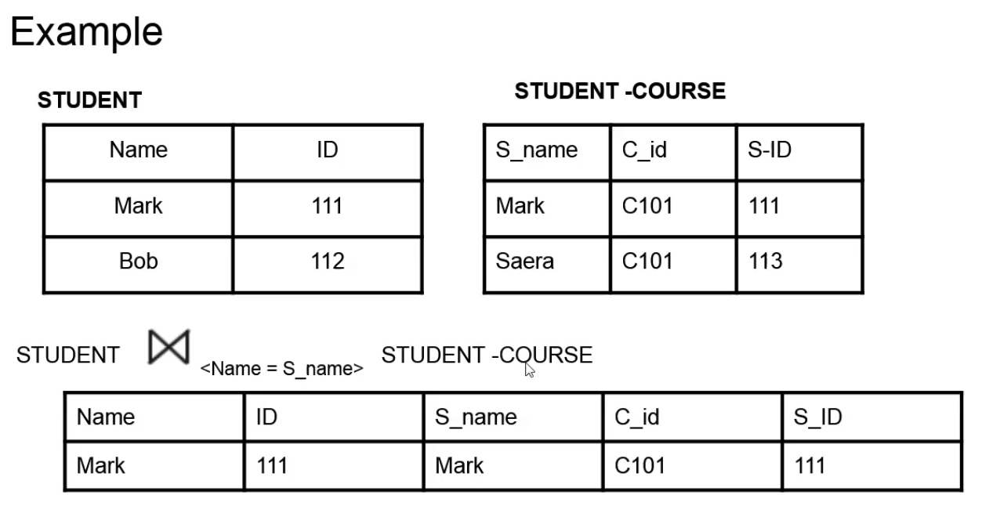

## Binary operations : set diff

the result of this operation, denoted by R-S, is a relaiton that includes all tuples that are in R but not in S.

UNION,INTERSECTION AND MINUS PROPERTIES

## Relational Algebra Operatoins from Set Theory : Cartesian Product (CROSS product)

Cross product will create wrong tuples

Wrong tuple: spurious tuple

### Drawback of cartesian product

- Cartesian product simply combines all the tuples in the first relation with all the tuples in the second relation. Most of the generatted tuples will be wrong tuples/ meaningless tupels.

- it will lead to wasteage of space

- to get corrct tuple we have to perform select operation just after a cross product operation.

## JOIN

 

