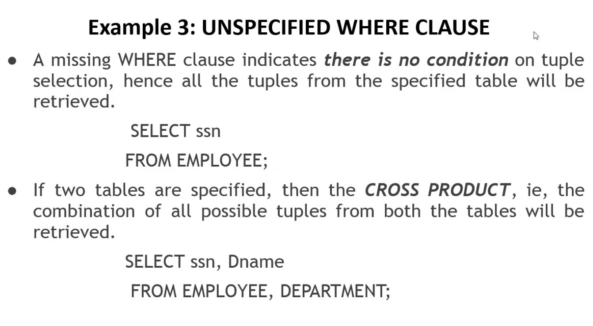

*table structure will be provided*


```
SELECT _, _, _
FROM _ ,_
WHERE _=_ AND _=_
```





```sql
Select * 
FROM EMPLOYEE,DEPARTMENT
WHERE DName='Research' AND Dno=Dnumber;
```


```
Union compatiblity for set operations is a necessary condition in set operations, according to it:
- same non of Attributes
- domain should be same 
- appear in same order
```

