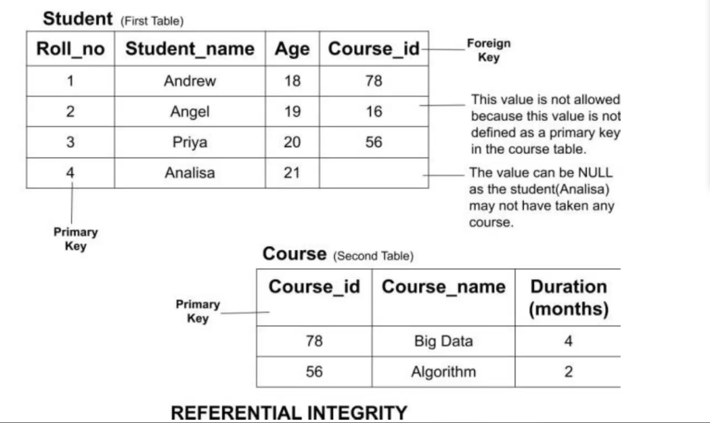
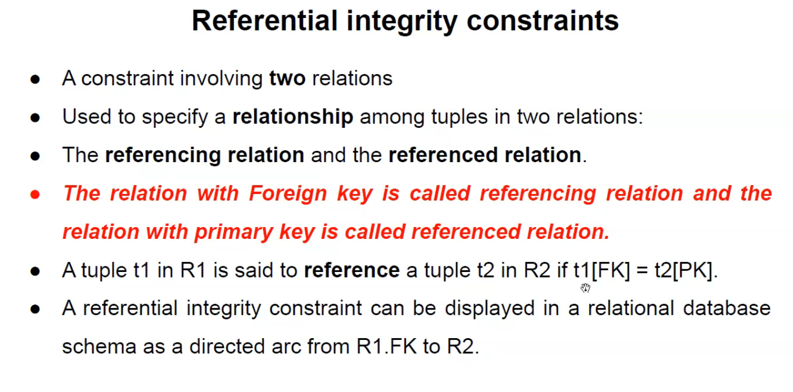
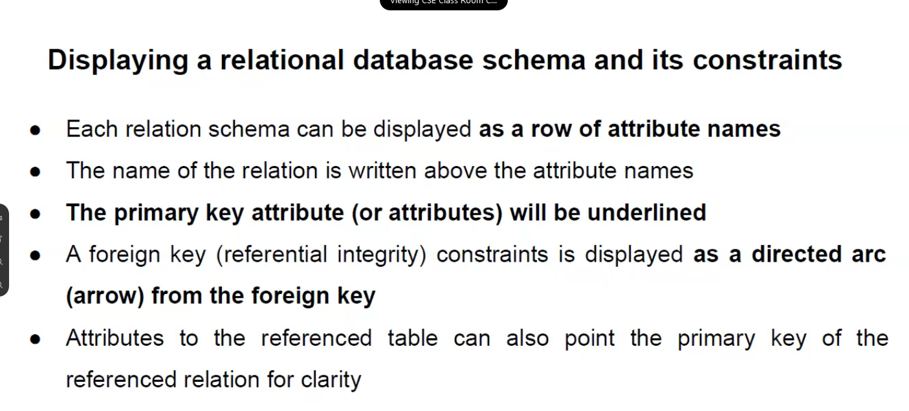
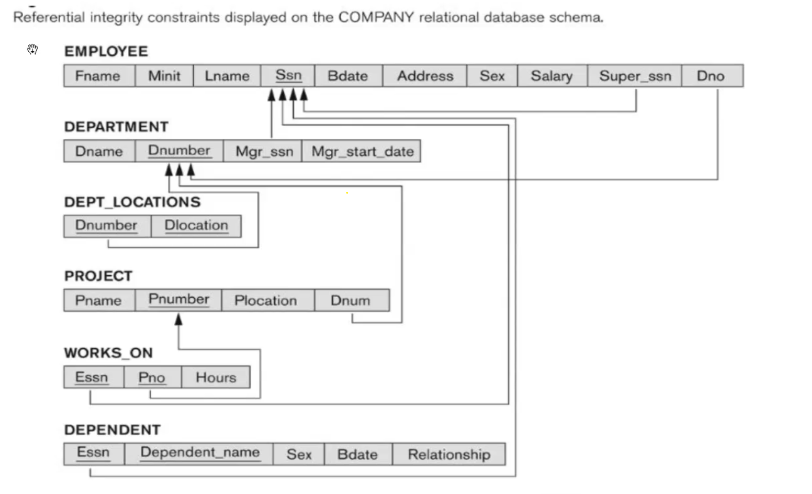
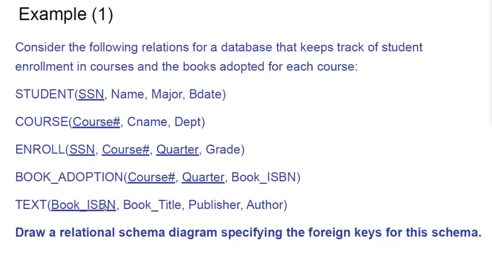

## Referential intergrity constraints

Forign Key is the primary key in another table.
It can be null also(but null primary key is error)

To represent the relation show an arrow from forign key to primary key

### quest

