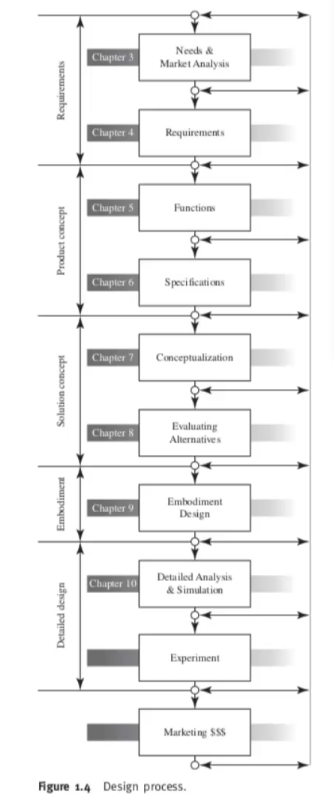

ON day one we went to darjling in a toy train

# day2

### Keramithra

# Engineering Design

Engineering design is the process of devising a system, component, or process to meet desire needs.

Design is both a scientific and a creative process.Einstein asserted that imagination is more important than knowlegde

It is a decision- making process , in which the basic sciennces , mathematics , and engineering sciences are applied to optimaly convert resources to meet a stated objective.

## Fundamental Elements

Establishment of objectives and criteriam synthesis, analysis,construction,testingand evaluation anre the fundamental elements of the design process.

If a product is poorly desingde the end product still will be  a bad idea and will ultimately fail, as no one likes to purchase a bad idea.

## Design Process 

### [Lucid air](https://www.youtube.com/watch?v=JwzOlPBheO0)

The design process is a sequence of events and a set  of guidelines that helps deine a starting point that takes the designer from visualiizing a product in his imagination to realizing it in the real life in a systematic manner.

the design of a device or a system acan be done in 2 ways:

* Evolutionary change 

* Innovation: Rapid scientific growth and technological discoveries as well as competition among companies fofr thier for thier slice of the market have places a great deal

### Design process elements

[Question eg:explain design steps for designing a watch]

* Identifying cutomer needs (requirments)

* market analysis (requirements)

* defining goals (requirements)

* Establishing functions (Prodct concept)

* Task Specifications (Prodct concept)

* Conceptualizatoin (Solution concept)

* Evaluating Alternatives

* Emnodiment Design

* Analysis and Optimization

* Experiment

* Marketing

### Identitying Customer Needs

The need for a new design can be generated from several sources, including the following:

* Client request

* Modigication of an existing design : often a  client asks for a modification of an existing artifact to make it simpler and easy to use.

* Generation of a new product : For an industry to survive in today's world,  it must continue to grow; it cannot afford to remain static.

### Market Aanalysis
Designers must locate what is alreasy available in the market and what they have to offer. Information gathering is a vital task. Design engineers may consult the following sources to determine market availability:

* Teachnical and trade journals

* Abstracts

* Research reports

* Technical libraries

* Catalog og component suppliers 

* US Patent Office

* The internet

### Defining Goals

In this stage of the design process, the designer defines what must be done to resolve 

### Establishing Functions

There is big difference b/w being asked to design a car suspension system and designing a car.It is useful to consiider the level at which the designer is aked to work.

### Specification
This stage requires the  designer to list all pertinent data and parameters that tend to control the design and guide it towards the desired goal; It also sets limits on the acceptable solutions

### Evaluating alternatives
Once a number of concepts have been generated in sufficient detail, a decision must be made about which one or ones will enter the next, most expensive , stages of the design process.

### Embodiment Design
This stage does not include any details yer but will beginto illustrate a clear definition of a part, how it will look, and how it interfaces with the rest of hte parts in the product assembly.

### Analysis and Optimizatiion

### Experiment
The experiment stage in engineering seding requires that a piece o fhardware is constructed and tested to verify the concept and analyssi of the design as to its work abilit, durability

3. Prototype : This is the most expensive experimental technique and the one producing the greatest maoutn fo useful information. The prototype is the constructes, full- scale working physical system.

### Marketing 

