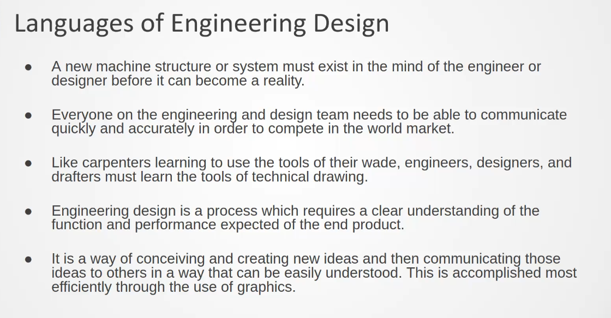
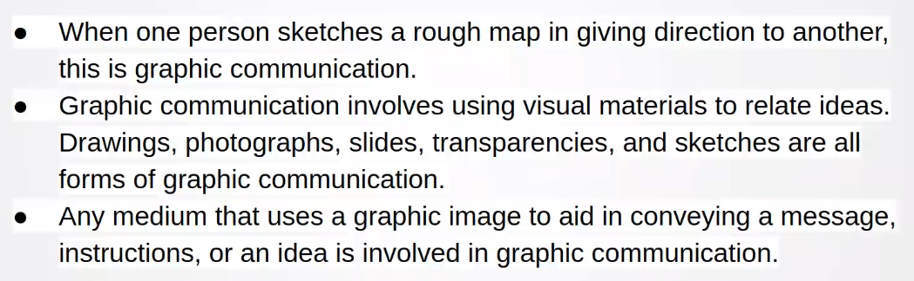
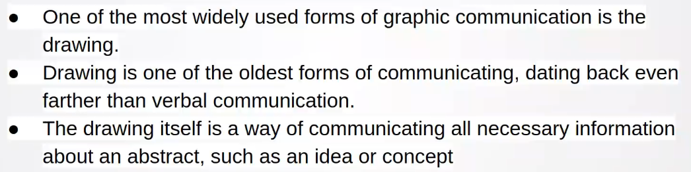
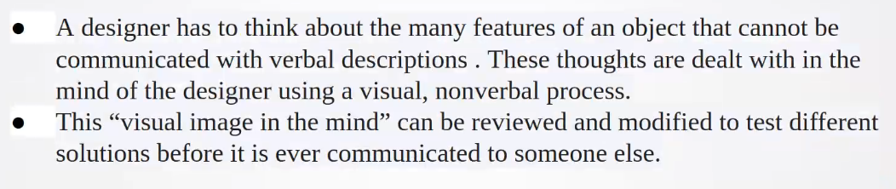
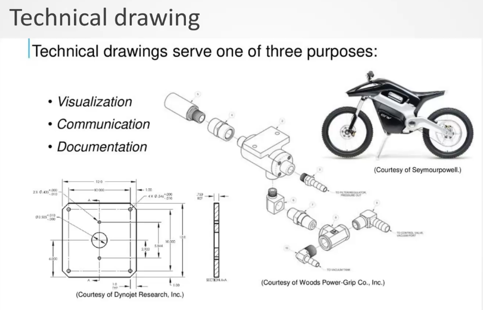

## Graphical Communications

Graphical communication is a complete lang used in the design process for visualization , commmunication , and documentation.

- A drawing is a graphic repr of an object , or a part of it, and is the result of creativve thought by an engineer or a technicians

