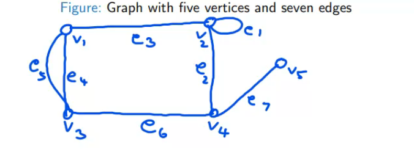

Intro to graaph theory
------

a graph G =(V,E) consists of  a set of objects V ={v1,v2,...} called vertices and another set E ={e1,e2,...} , whose elements are called edges , such that each edge ek is identified with an unordered pair (vi,vj) of vertices

The verices vi,vj

An edge having the same vertex as both its end vertices is called a *__self-loop__*

more than one edge associated with a given pair of vertices  are referred to as *__parallel edges__*

A graph without any self-loop or parallel edged is called *__simple graph__*

if the number of veritces is finite its called a *__finite graph__*, otherwise its a *__infinite graph__*

