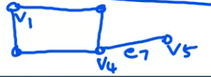
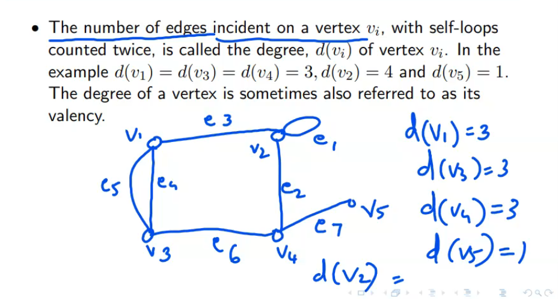
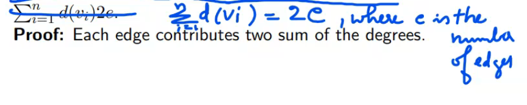
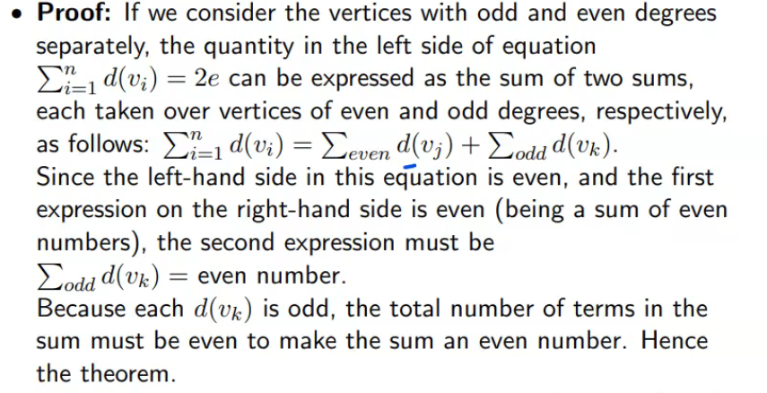

When a vertex vi, is an end vertex of some edge ej, vi and ej are said to be incident with each other

Edges e2,e6 and e7 are incident with vertex v4.

Two non parallel edges are said to be adjacent if they are incident on a common verrtex. e2 and e7 are adjacent.

Tow vertices are sic to be adjacent if threy are the end vertices of the same edge. v4 and v5 are adjacent,but v1 and v4 are not

## First Theorem of graph theory 
the sum of the degree of all vertices in G is twice the number of edges in G.

## Theorem 2 : the number of vertices of odd degree in a graph is always even

Definitions
------
- A vertex having no incident edge is called an *__isolated vertex__* . *__Isolated vertices__* are vertices with zero degree.
- A vertex of degree one is called a *__pendant vertex__* or an *__end vertex__* .
- Two adjavent edges are said to be in *__series__* if their _common_ vertex is of degree two.
- A graph, without any edges is called a *__null graph__* . Every vertex in a null graph is an *__isolated vertex__*.
- The list of degree of vertices of a graph G is called its *__degree sequence__*. The degree sequence of the graph is the previous example is (3,4,3,3,1)

