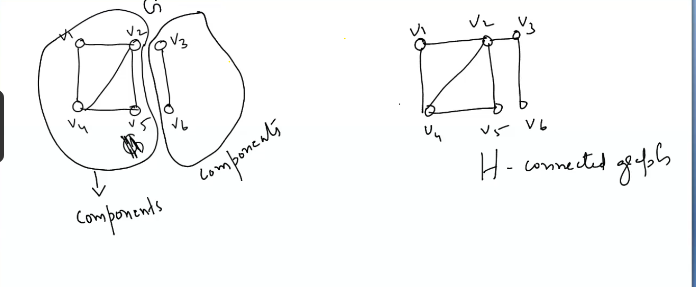

- A graph G is said to be connected if there is at least one path between every pair of vertices in G. Otherwise, G is a _disconnected_

- A null graph of more than one vertex is disconnected

-  A disconnected graph consists of two or more connected graph. Each of these connected subgraphs is called a _component_

## Theorems

Sum of degrees of verteces is even

there will be even no of odd vertices

### theorem1.3 : 
A graph G is disconnected if and only if its vertex set V can be partitioned into two nonempty, disjoint subsets V1 and V2 such that there exist no edge in G whose one end vertex is in subset V1 and other in subset V2.

### Prove: 
Suppose that such a partitioning exists.Consisder two arbitraty vertices a and b of G such that a_E_V1 and b_E_V2 . No path can exist between vertices a and b ' otherwise, there would be at least one edge whose one end vertex would be in V1 and the other in V2. Hence, if a partition exists, G is not connected. 

COnversly , let G be a disconnected graph. Consider a vertex a in G. Let V1 be the set of all vertices that are joined by paths to a. Since G is disconnected, V1 does not include all vertices of G. The remaining vertices will form a (nonempty) set V2. No vertex in V1 is joined to any in V2 by an edge. Hence the partition.

## Theorem 1.4

if a graph (connected or disconnected) has excatly two vertices of odd degree, there must be a path joining these two vertices. 

### Proof
Let G be a graph with all even vertices except vertices v1 and v2, which are odd. From Theorem1.1, which holds for every graph and therefore for every component of a disconnected graph, no graph can have an odd number of odd vertices. Therefore, in graph G , v1 and v2 must belong to the same compponent , and hence must have a path between them.

## theorem 1.5

## Problems
1. Construct a simple graph of 12 vertices with 3 of them having degree1 , 3 of them having degree 3 and remaining 7 having degree 10.

ans: Such a graph does nto exist since there are odd number of odd vertices here. By theorem 1 we know that a graph has even number of odd vertices.

2. What is the largest no of vertices in a graph with 35 edges if all vertices are of degree atleast 3 ?

ans: 18

