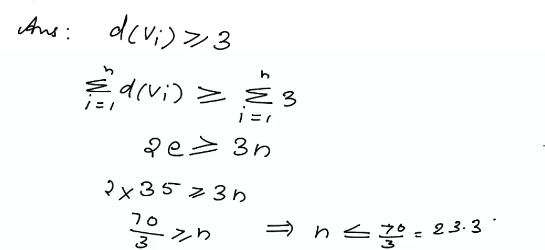
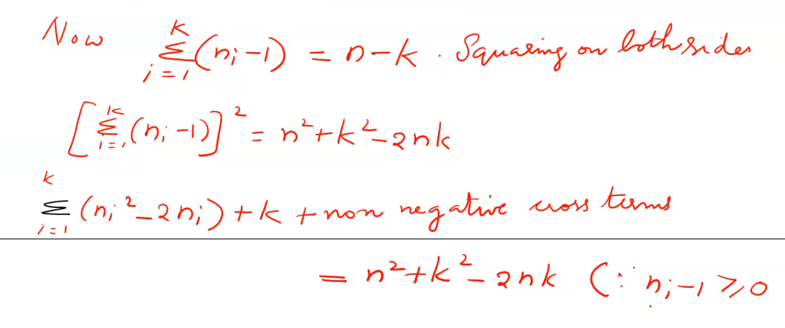
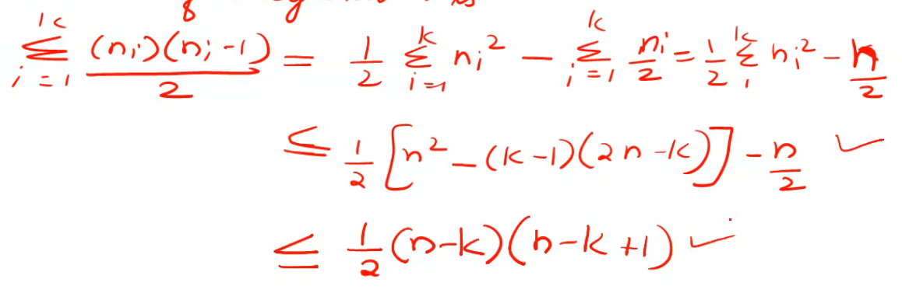
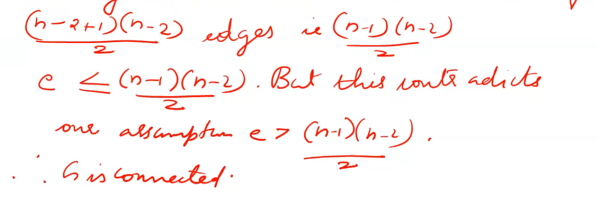

#### quest: 
What is the  largest number of vertices in a graph with 35 edges and if all vertices have degree atleast 3?

#### ans:

_Max no of vertices = 23_ 

#### _Theorem_:
a simple graph with n vertices and k components can have at most (n-k)(n-k+1)/2 edges

#### Proof
Let the number of vertices in each of the k components of a graph G be n1,n2,...,nk.

Thus n1+n2+...+nk = n, n _i_>=1 

Now the max number of edges in the i the componenet of G is ni(ni-1)/2 . Therefore the max no of edges in G is

#### Prove that 
a simple graph with n vertices is connnected if it has more than (n-1)(n-2)/2

#### ans:

Suppose G has more than (n-1)(n-2)/2 edges and is diconnected say with 2 componets . Then by above theorem it has maximum of (n-2+1)(n-2)/2edges

