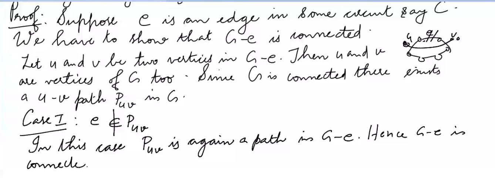
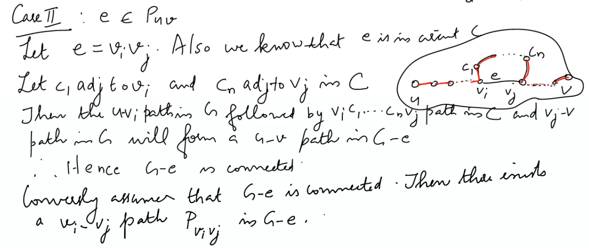
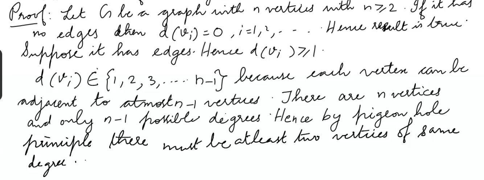
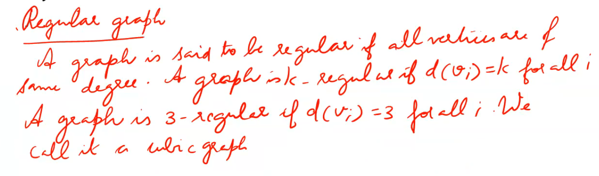
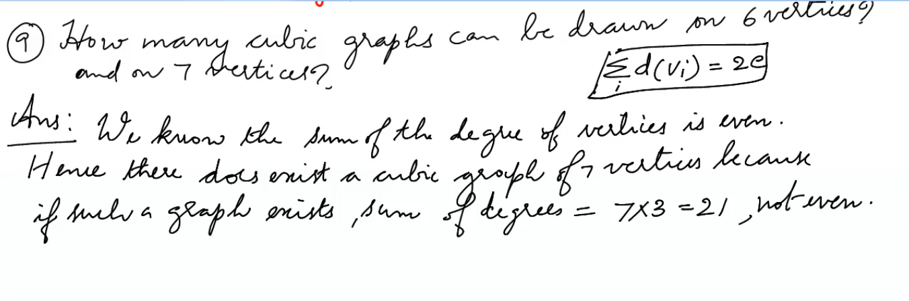

4. Prove that a connected graph G remains connectecd after removing an edge e from G

Now this path together with edge e forms a  circuit in C. Hence e belongs to same circuit.

5. PT for any simple grahp with atleast two verices has two vertices of same degree

Regular graph
---

9.How many cubic graphs can be drawn on 6 vertices?
and 7 vertices?

