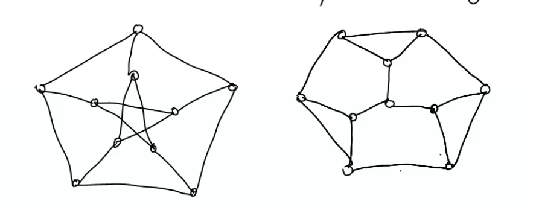

Draw tow non isomorphic cubic graphs on 10 verrtices3 regular , d(vi)=3 cubic for all i



1. P.T. if a  connected graph G is decomposed into subgraphs  G1, G2 , there must be atleast one vertex common to G1, and G2
```
Ans.  Given G is a connected graph with 

V(G) = V(G1) U V(G2)

E(G) = E(G1) U E(G2) and E(G1)intersection E(G2)=phi

To S.T.

V(G1) intersection V(G2) != phi

if there is no vertex in common to G1 and G2 , then when we take the union of the graphs , we get
disconnected graphs which is contradiction to the fact theat we started with a connected graph.
```

2. P.T every n vertex graph with n edges contains a cycle .

```
Consider n vertices and add edges one by one .If an edge  is added between two vertices of same component then we will get a cycle and the proof is done. 

If not , addition fo edge will reduce the number of componetns by 1. Hence after adding n-1 edges if no cycle is formed then there is exactly one component, hence the n the edge must form a cycle.

```

3. S.T any two simple connected graphs with n vertices , all of degree 2 are isomorphic . 
```
Ans. d(vi) = 2 

The no of edges = 2n/2 = n

By prev problem every n vertex graph with n edges contains a cycle. Let G1 be v1, v2, vn will n vertices and edges.

Let G1 be v1,v2,...vn  with n vetices and n edges

Let G1 be w1,w2,...wn  with n vetices and n edges

Let f: G1->G2 be f(vi)=wi

This will be isomorphism
```

4. Consider a graph with 4 verrtices v1,v2,v3,v4 and degree of vertices are 3,5,2 and 1 resp. Is it possible to construct such a grpah? If not why?

```
Here ther are odd degree vertices.

Because by then we know that the no of odd vertices is even.So no such graph is possible


```


