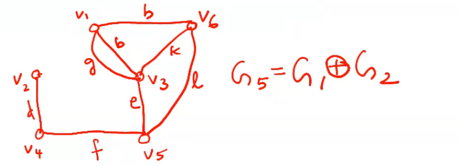

Mod2- Eulerian and Hamiltonian Graph
---
- Euler graphs
- Operations o n graphs
- Hamiltonian path + circuits 
- Travelling Salesman problem
- Directed graphs- types of digraphs
- Digraphs & Binary relation
- Directed paths
- Fleurey's algorithm

## Operations on Graphs

- The union of graphs G1=(V1,E1) and G2=(V2,E2) is another graph G3 (Written as G3=G1UG2 whose vertex set V3=V1UV2 and the edge seett E3=E1UE2

## Intersection
The Intersection G1UG2 of graphs G1 and G2 is a graph G4 consisting only og those vertices and edges that are in both G1 and G2

## Ring Sum

The Ring Sum of two graphs G1 and G2 (written as G1 +O+(Xor symbol) G2) is a graph consisting of vertex set V1Uv2 and of edges that are either in G1 or G2 but not in both

If g is asubgraph of G, then G(xor symbol)g is, by definition,that subgraph of G which remains after all the edges in g haave been removed from G. Therefore G(xor)g is written as G-g whenever g<=G. Because fo this complemetary nature, G(xor)g=G-g is often called the __complement of g in G__.

The complement of a graph G is definved as G'=Kn-G

A graph which is isomorphic to its complement is called self complementary graph.

Decomposition: A graph G is said to have been decomposed into two subgraphs g1, and g2 if g1 U g2 =G and G1 intersection g2 is a null graph.

## Vertex deleted Subgraph
If vi is a vertex in a graph G, then G-vi denotes the subgraph of G obtained by deleting (ie removing) vi from G. 

Deletion of a vertex always implies the deletion of all edges on that graph.

## Edge deleted subgraph 
If ej is an edge in G, then G-ej is a subgrpah of Gobtained by deleting ej from G. Deletion of an edge does not imply deletion of its end vertices. Therefore G-ej = G(xor)ej

