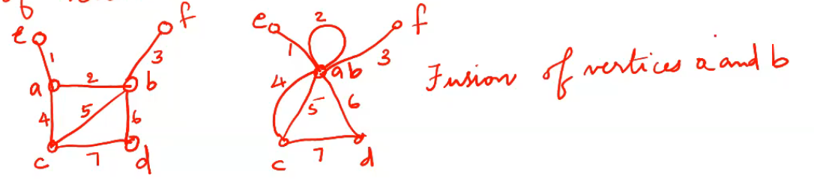
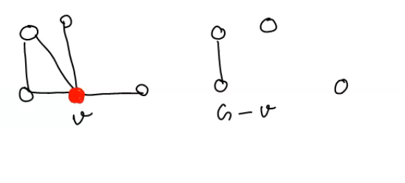
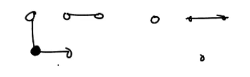

Fusion :  a  pair of vertices a,b in a graph are said to be fused(merged or identified) if 2 vertices are replaces by a single new vertex such that every edge that was incident on either a or b or on both is incident on the new vertex . thus the fusion of 2 vertices does not alter the number of edges but it reduces the number of vertices

Cut Vertex or Articulation pt
---
A verrtex v of a graph G is called a cut vertex if G-v is a disconnnected graph or has more componenets than G.

Cut Edge or Bridge
---
An edge e of a graph G is called a cut edge or bridge if G-e is a disconnected graph or has more components than G.

Euler line
---
A closed walk running through every edgge of G exactly once is called a Euler line

A graph that consists of an Euler line is called an euler graph

Note: The euler line contains all the edges of the graph and  an  euler graph is always connecgted, except fot any isolated vertices the graph may have . Since isolated vertices do not contribute anything to the understanding of an euler graph. It is here after assumed that Euler graphs do not have any isolated vertices and therefore connected.

## Theorem 2.1: Necessary and sufficient condition for an Euler graph 

A given connected graph G is an Euler graph iff all vertices of G are of even degree.

- Proof

Suppose that G is an Euler graph . It therefore contains an Euler line (closed walk).In tracing this walk we observe that every time the walk meets a vertex v it goes through two new edges incident on v.

> with one we "enter" v and with the "exited"

This is true not only for all intermediate vertices of the walk but also true for the terminal vertex because we "exited" and "entered" the same vertex at the beginning and end of the walk resp-ly. Thus if G in an Euler graph , the degree of every vertex is even.

Conversly assume that all vertices are of even degree .Now we construct a walk starting at arbitararyvertex v and going through the edges of G such that no edge is traced more than once. We continue tracing as far as possible . Since every vertex is of even degree , we can exit from every vertex we enter, the tracing cannot stop at any vertex but v. And Since v is also of even degree we shall eventually reach v when the tracing comes to an end . If this closed walk H we just traced.

