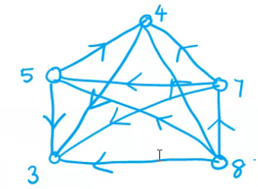

## reflexive relation of digraph
The digraph of a reflexive relation will have a self loop at every vertex. Such a digraph representing a reflexive binary relation on its vertex set is called reflexive digraph

## Irreflexive digraph
A digraph in which no vertex has a self loop is called an _irreflexive digraph_.

## Symmetic Relation
A relation R in which if xi R xj (xi related to xj) also holds for all xi and xj is called a symmetric relation.
```eg
"Is spouse of" is a symmetric relation but irreflexive relation.

"Is equal to" is symmetric and reflexive.
```
The digraph of a symmetric relation is a symmetric digraph because for every directed edge from xi to xj there is a directed edge from xj to xi.

Note: Every undirected graph is a repr of some symmetric binary relation (on the set of its vertices). Furthermore every undirected graph with e edges can be though of as a symmetric digraph with 2e edges

## Transitive relation
A relation R is said to be transitive iff for any three elements xi,xj,xk in the set , xi R xj and xj R xk always imply xi R xk. 

The relation "is greater than" is a transitive relation.  

In the digraph of a transitive (but irreflexive and assymetric) binary relation there will be triangular subgraphs

A digraph representing a transitive relation (pn its vertex set is called a transitive digraph)



## Equivalence Relation
A binary relation is called an equivalence relation if it is reflexive, symmetric and transitive.
```eg
"is parallel to"
"is equal to"
"is congruent to"
"is equal to modula m"
"is isomorphic to"
```

The graph representing an equalence relation is called an __equivalence graph__

An equivalence relation on a set partitions the elements of the set into classes(called equivalence classes) such that two elements are in the same class iff they are related.

_Symmetry ensures that there is no ambiguity regarding membership in the equivalence class_

_Transitivity ensures that in each componet e_

