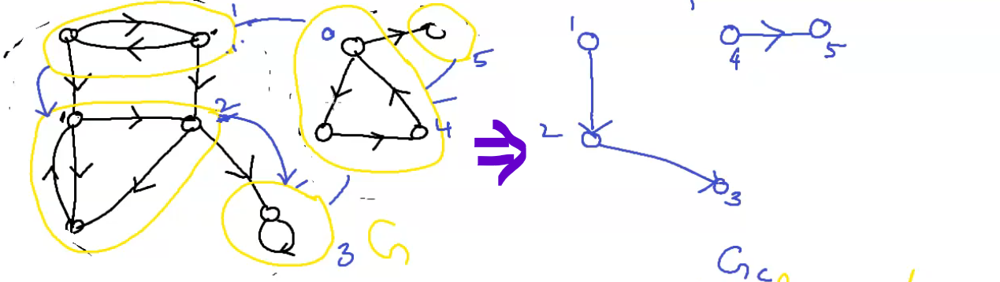

## Strongly Connected graph
A strongly conn graph is a graph that can traveeerse from any vertex to any other vertex.

maximal strongly conn subgraph -  fragment.

Represent all the thus found fragment as a vertex we get a condensation graph




# Mod 3 - Tree and graph algorithm
```
Tree: a tree is a connected graph without any circuit.
```
- it should be connected
- it does not have a circuit/cycle

### Theorem 1
There is one and only one path between any pair of vertices in a tree T.
```
Proof:
let a,b be any two distinct vertices. 
There is apath between a and b since T is a tree which is connected. 
Suppose there are two paths between a and b. 
Superimposing the path and removing the common edge results in one or more cycles.

But a tree has no cycle, Thus there cannot be two paths between a and b.
```

### Theorem 2
If in a graph G there is only one path


