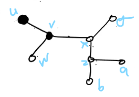
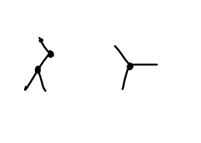

## Metric
A function f(x,y) of two variables satisfying the conditions
- non-negativity : F(x,y)>=0 and f(x,y)=0 iff x=y
- symmetric : F(x,y)=f(y,x)
- triangular inequility: F(x,y) <= F(x,z)+ f(z,y) for any z

is called a `metric`. 

The distance d(vi,vj) between two of its vertices vi and vj is the length of the shortest path between them.

#### Theorem 7

The distance d(vi,vj) between two vertices of a connected graph is a metric

```
Proof: 

satisfied
---------
1. Non-negativity: d(vi,vj) >= 0 and d(vi,vj)=0 iff vi=vj  
2. Symmetry: d(vi,vj) = d(vj,vi)
3. triangular inequility: d(vi,vj) <= d(vi,vk)+d(vk,vj)

```


Eccentricity: E(v) of a  vertex v in a graph G is the distance from v to the vertex farthest form v in G, i.e 
E(v) = max d(vi,v)



Centre : A vertex with minimum eccentricity in graph G is called a centre of G.
`x in fig`

Radius :  The minimum eccentricity in a graph is defined as the radius of the graph 
`2 in fig`

Diammeter: the diameter of a tree is defined as the max eccentricity of the graph.
`4 in fig`

#### Theorem 8

Every tree has either one or two centres 
