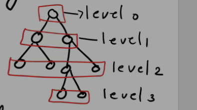

#### Properties
	1. The number of verices n in a binary is always odd . this is because there is exactly one vertex of even degree, and n-1 vertices are of odd degree. we know that in a graph, there are even number of odd vertices ir n-1 is even . There , the number of vertices n is odd.

	2. Let p be the number of pendant vertices in a binary tree T. Then n-p-1 is the number of vertices of degree 3. Therefore the number fo edges in T equals (1/2)*[p+3(n-p-1)+2]=n-1
	, p=(n+1)/2

A non pendent vertex in a tree is called an internal vertex

The number of internal vertices in a  binary tree is n-p = n-((n+1)/2) = (n-1)/2 = p-1

In a binary tree a vertex vi, is said to be at levvel li if vi is at a distance li from the root. Thus the root is at level 0.

in the above fig
n=9, p=5

There can be only one vertex at level 0

There can be atmost 2 vertices at level 1 .
There can be atmost 2^2 vertices at level2 and so on...

Therefore, the max no of vertices at lvl k is 2^k.

Therefore the max no of vertices fro a k lvl binary i n <= 2^0+ 2^1+ ...+ 2^k

The max lvl, lmax of any vertex in a binary tree is called the height of the tree. The minimum possible height of an n vertex binary tree is min(lmax) =  (log2(n+1)-1)

The max possible height of an n vertex binary tree is max(lmax) = (n-1)/2

The path length(external path lenght) of a tree, is defined as the sum of the path length from the root to all pendent vertices

