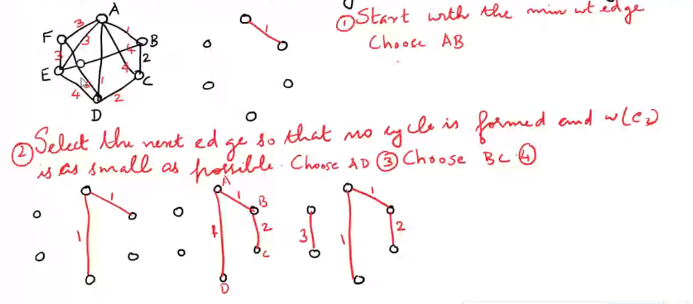
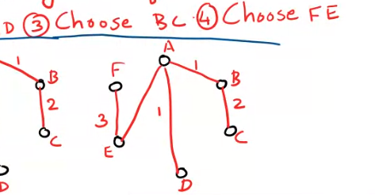
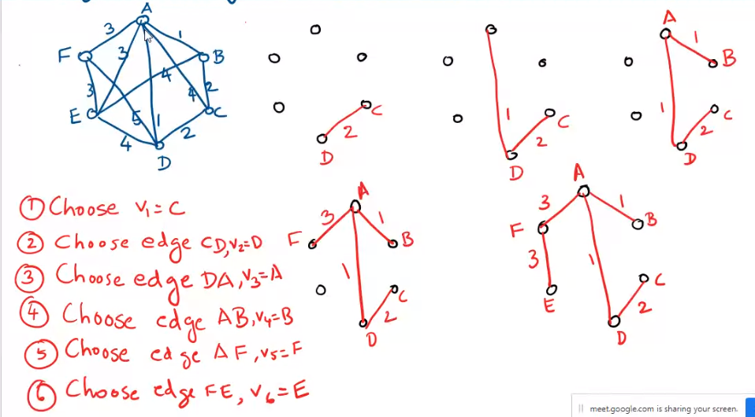

1.Fing the minimal spanning tree for the grpah using Kruskal algorithm?

weight=10

2.Find the minimal spanning tree for the S graph using prim's algorithm?

weight=10

3. Find the minimal spanning tree for the grpah using Kruskal and prim's algorithm