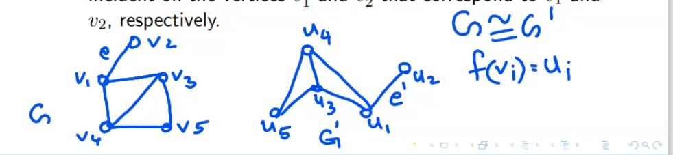
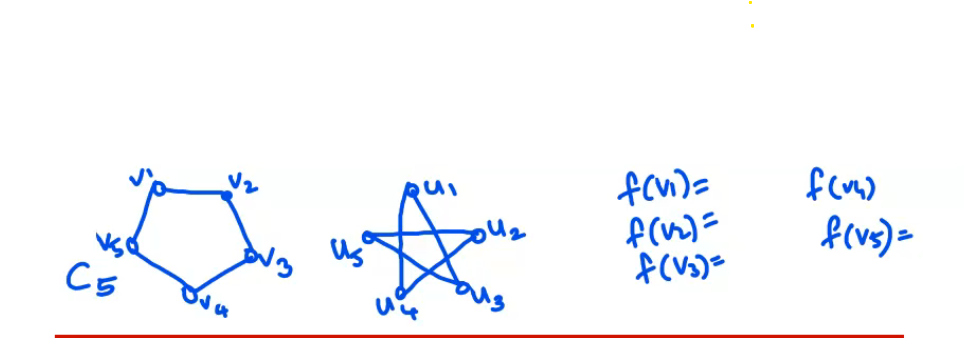

## Path

Path on n vertices is denoted by P _n_. It has n vertices and n-1 edges.

## Cycle/CIrcuit

Cycle or circuit on n vertices is denoted by C _n_. It has n vertices and n edges.
 
## Bipartite graph

A graph G is called bipartite  if its vertex set V can be decomposed into two disjoint subsets V _1_ and V _2_ such that every edge in G joins a vertex in V _1_ with a vertex in V _2_.

## Complete Bipartite graph

A graph G is called complete bipartie if its vertex set V can be decomposed into two disjoint subsets V _1_ and V _2_ suuch that every edge in G joins a vertex in V1 with a vertex in V _1_ with a vertex in V _2_ and it has all such possible edges.    

## Isomorphic Graph

two graphs G and G' are said to be isomorphic if there is a one-to-one correspondence between their vertices and between their edged such that the incidence relationship is preserved.

In other words, suppose that edge e is incident on vertices v1 and v2 in G; then the corresponding edge e' in G'' must be incident on the vertices v1' and v2' that correspond to v1 and v2, respectively

