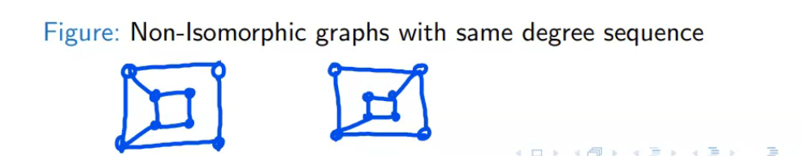
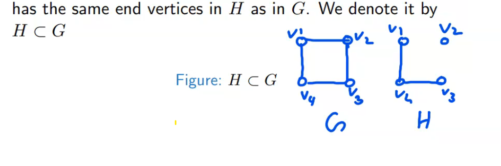
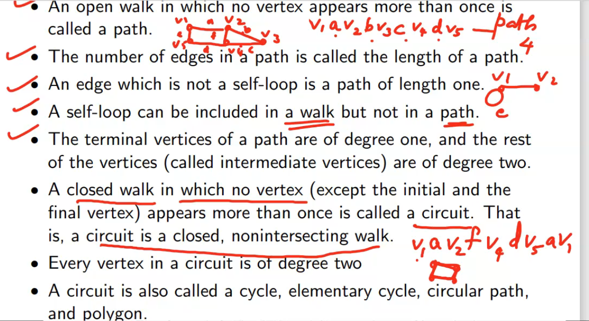

<small>examples of a non isomorphic graph</small>

![isomorphicandNonIsomorphicGraphs][./img/isomorphicandNonIsomorphicGraphs.png]

## Two isomorphic graphs must have

1. the same number of vertices
2. the same number of edges
3. an equal number of vertices with a given degre.
4. Same degree sequence.

These conditions are not sufficient | There are non-isomorphic graphs which satisfy all these conditions.

A graph H is said to be a subgraph of a graph G if all the vertices and all the edges of H are in G, and each edge of H has the same end vertices in H as in G. We denote it by 

An open walk in which no vertex appears more than once is called its _**path**_.

- the number of edges in a path is called the _length of a path_

- A self-loop can be included in a _walk_ but not in a _path_

- The terminal vertices of a path are of degree one, and the rest of the vertices  (called the intermediate vertices) are of degree two.

- A closed walk in which no vertex(excep the start and end) appears more than once is called a circuit. It is closed | nonintersecting walk.

- Every vertex in a circuit is of degree two.

- A circuit is also called a cycle, elementary cycle, circular path and polygon.

