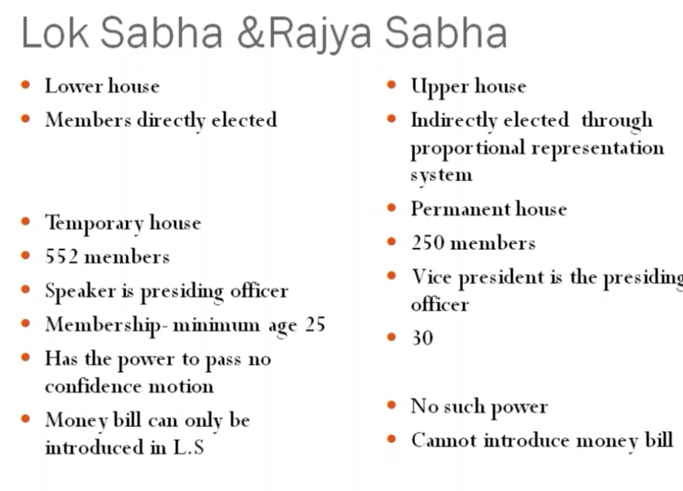

# Mod 3 (continues)

### union Legislature

the body of people's repr which forms the laws of a democratic country

or 

The law making body at the cntre Government is called as union parliament

It comprises of 
- president
- house of people (lok sabha)
- the counci of states (rajya sabha)

There is two houses of legistature , hence it is called bicameral legislature.

## LokSabha

max = 552 ppl

- Not more than 530 repr the states
- 2 from anglow indian community 
...

#### Qualification
- He should be an Indian citizen
- He should be at least 25 yrs of age
- He shouln't hold any office of profit under government of india
- he should have his name in electoral rolls in any   part of the country.
- he should be of sound mind

#### Tenure
- 5 yrs unless disolved by president

## Rajyasabha

Council of States

max = 250 ppl

238 from states ,
12 members nominated by the president form ppl who have achieved distinction in field of art, literature , ...

#### Qualification

#### Qualification
- He should be an Indian citizen
- He should be at least 30 yrs of age
- He shouln't hold any office of profit under government of india.
- he should not be an insane or bankrupt
- he should not have been disqualified

#### Tenure
- the Rajyasabha is a permenent house.
-  it is not subject to dissolution as a whole

...

## Funtions of Parliament
- legislative Functions
- Executive functions
- Financial functions
- Amending Powers

### Legislature functions
- supreme law making body
- Parliament can make laws related to union list, state list and concurrent list.

### Executive functions
- president,pm, counsil of Ministers
- Executive of laws and policies are ensured by the office of executive(PM and Council of Ministers)
- Parliament can remove ...

### Financial functions
- The executive cannot spent money without the approval of Parliament
- Union budget prepared by the cabnet is submitted for the approval by the parliament
...

Ammending Powers
- Paliament has the power to amend constitution
- Amendments will have to be passed in both Lok and Rajya Sabha for them to be effective