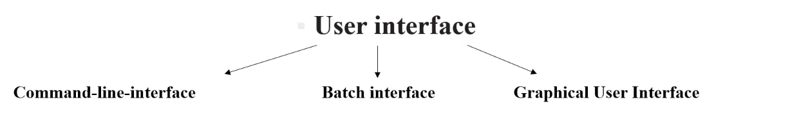

## Operating system services to the user

provides certain services to programsand to the users of tthose programs 

One set of operating system services provides functions that are helpful to the user

batch interface works in background

* Program execution

the system must be able to load  a prog into memory and to run that prog, must be able to end its execution, either normally or abnormally

* I/O operation

a running program may require i/o , which may involve a file or an i/o device.

* File system manipulation

* Communication

* Error detection

## Operating system services to the systems

* Resource allocations

* Accounting 

* Protection and security

