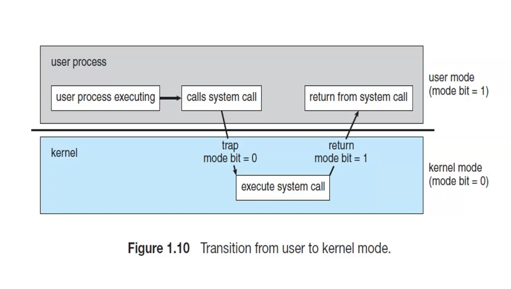

# day1 review
----------
### users view
 
single user 
 
multiple user
 
multiple users conneccted to servers
 
mobille computers

### system's view
 
resource allocator
 
control program
 
kernal is the core part
 
system program and application programs
 
mobile os include middleware

### OS structure
 
multiprogramming
 
resources are utilised effectively
 
time sharing

# day2
------
modern OS are interrupt-driven

error/interrupt in a program is trap/exception eg:hardware interrupt- access a
memory loc not allowed right now

Interrupt service droutine(ISR) is provided to deal with the interrupt

dual mode and multi-mode operation
----
to protect os from wrong users
### dual

2 seperate modes : user mode and kernal mode(supervisor,system,privileged mode)
a bit called the mode bit is added to the hardware of the comp to indicate
the current mode: kernel(0) and user(1)

### multi mode

eg: I/O control,switch kernal mode,time management, interrupt management
supports vitrualization

more options than user moder but less options than kernal mode

cpu's that support virtuallization frequently have a separate mode to
indicate when the virtual machine manager(VMM)

Timer
-----
a timer can be set to interrupt yhe computer after a task period.

a variable timer is generally implemented by a fixed-rate clock and a counter
the OS sets the counter

instrutions that modify the content of the timer are privileged

use : prevent the prog from running too long

