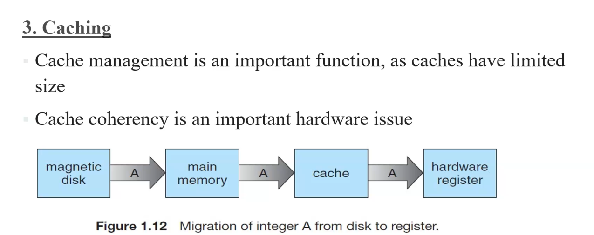

## 1.Process management
------------------
process:  a prog in executation
 eg: a word processing program, sending o/p to a printer etc.

a program is a passive entity
a process is an active entity

* functions assosiated with process management

  * Scheduling process and threads on the CPU (since there will be more than one process running)

  * Creating and deleting both user and sustem processes

  * suspending and resuming processes

  * providing mechanisms for synchronization

  * Providing mechanisms for process communicatino

all these are done through system calls

## 2.Memory management
----
Mani memory is a large array of bytes ther arises the needfor memory management
Instructions must be in memory fo rexections

* Functions associated with memory management
 
   * allocation and deallocation of memory space
 
   * keep track of which parts of memory are currently being used and who is using them
 
   * deciding which data to move in and out

## 3. Storage management
---
### 1.file amanagement
* when multiple users tyr to access file, OS will control which user may access a file and how that user may access (eg: read, write, appedn)

* Functions associated with file management
 
  * creating and deleing derectories to organize files

  * Supporting primitives for manipulating files and directories 

  * Mapping files into secondary storage

  * Creating and deletin file
backing up files on stable storage media

### 2.Mass storage maangement
the computere system provides secondary storage to back up main memory

* Function with secondary storage management

  * Free-space management

  * Storage allcoation

  * Disk scheduling

* FUctions with tertiary manaagement

  * Mounting and unmounting media in devices

  * Allocations and freeing the devices for exclusive use by process 

  * Migrations data from secondary to tertiary storage

### 3. Catching
---
used for fast retrival of data

 

when updationn occurs in any part f the memory evry part should be updated ,its called cache coherency

spoolig : temperary data storage mechanism, stored in secondary storage devices

buffering : usees area inside the main memory

## 4.I/O systems
---
act as an interface b/w  user and system
* a general device-friver interface 

* driivers for specific hardware devices

* a memory -management component htat includes buffering, caching, and spooling
 (*spooling taking space from the disk,used with data transfer b/w input output devices
 *buffering does not have a huge maount space, 
)

## 5.Protection and security
---

* Mechanism for controlling the access of processes or users to the resources deefined b a comp system

* an unprotected resource cannot defend against use by an unauthorized or incompetent user

* A protection-oriented system provides a means to distinguish b/w authorized and unauthorized usage

