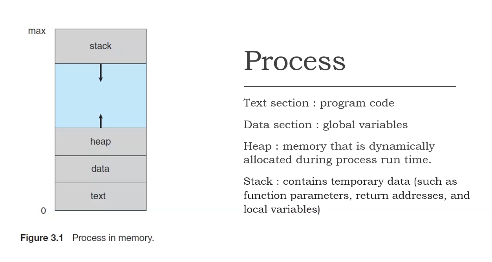
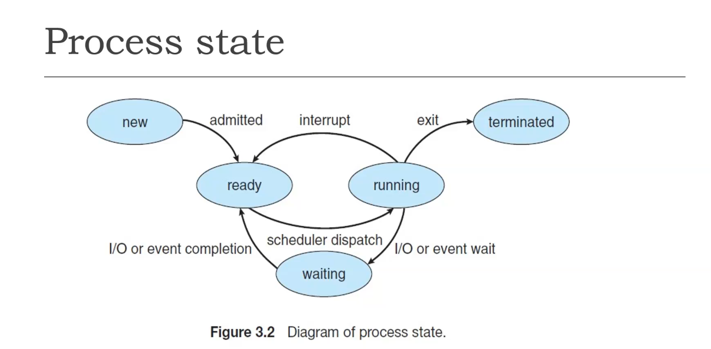

## Process 

- a prog in execution
- a system consists of a collection of processes: system code + user code
- a prog becomes a process when an executable file is loaded into memory
- 2 common techniques for loading exectuable files: double-clicking an icon repr the executable file and entering the name of the executable file on the commond line

### Process state

the current activity of that process

a new process may be in one of the foll:

1. New: the process is being created
2. Ready: the process is waiting to be assigned to a process
3. Running: being executed
4. Waiting: the process is waiting for some event to occur
5. Terminated: finshed execution

#### Process state diagram

