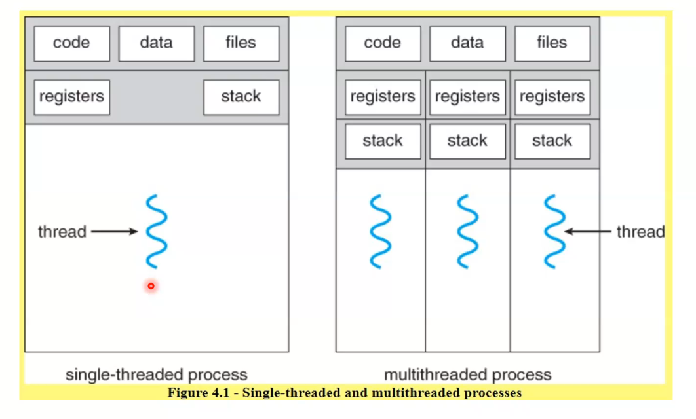
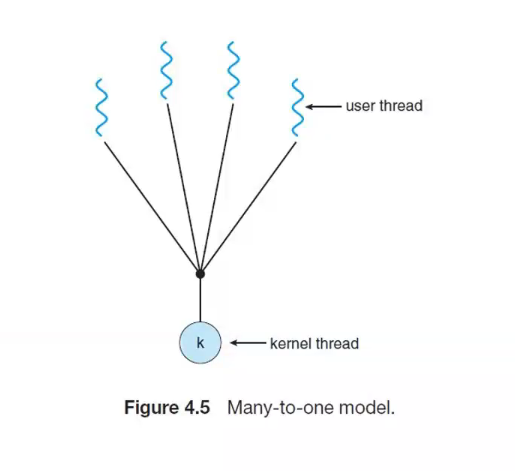
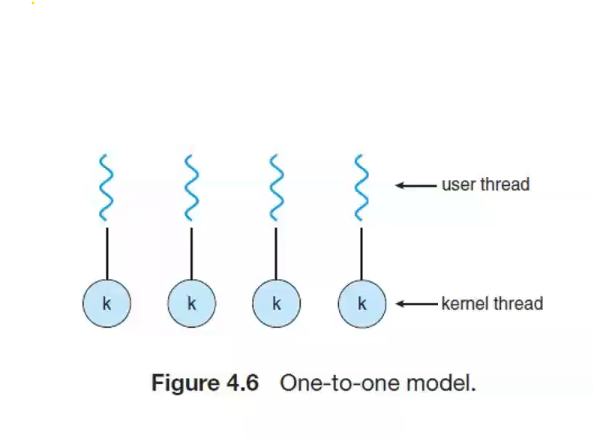
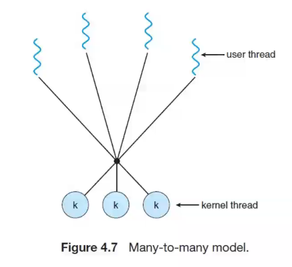

## Thread 

- A thread is a path of execution within a process

- A thread is a basic unit of CPU utilization, consisting of a program counter, a stack, and a set of registers, (a thread ID).

- A thread is also called a lightweight process

- THreads are very useful in mordern programming whenever a prcess has multiple tasks to perform independently of the others.

- A process can contain multiple threads.

- This is when one of the tasks may block, annd it is desired to allow the other tasks to procees without blocking.

## Benefits of multithreaded programming

REsource sharing: this quality is especially useful in designing user interfaces

Scalability:  

Responsiveness

Economy

## Multithreading Models

2 types: user threas and kernal threads

### 1. many to one model 

- maps many yserr-level threads to one kerne thread.
- the entire process will blocke if a thread makes a blocking system call.
- beacuase only one thread can access the kenel at a time, multiple threads are ubable to run in  parallel on multicore systems.

#### adv
- less overhead
- eady to manage

#### dis-adv
- if one is block all other thread is blocked

### 2.  ONe to one model

- maps each user thread to kernel thread
- allows meltiple threads to run in parallel on multiprocessors
- only dreaback to this model is that creating a user thread requires creating the correstpoding kernell thread.

#### adv
- cuncurrency achieved

#### dis-adv
- more overhead

### 3. many to many model

- multiplexes many user-level threads to smaller or equal number of kernel threads.
- number of kernel threads may be specific to either a particular application or a particular machine.
- developers can create as many user threads as necessary
- when a thread perrdorms a blocking system call the kernel can schedule another thread for execution

#### adv
- Better concurrency

