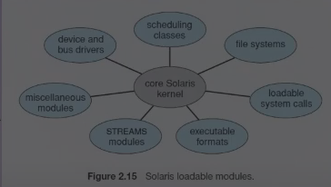

3. microkernels

structure the os by removingg all non-essential components form the kernel 

provide minimal process and memory management , in addition to a communication facility

the main function is to provide communication between the client program and the various services that are also running in user space.

communication is provided through __message passing__

4. modules

design involves using loadable kernel modules

the idea of the design is for the kernel to provide core services while other services are implemented dynamically as the kernel is running

5. Hybrid Systems

Combine different structure , resulting in hybrid systems that address that address performance , security, and usability issues.

## system boot

the procedure of starting a computer by loading the kernal is known a as booting the system.

bootstrap program or bootstrap loader: a small piece of code that locates the kernel, loads it into the main memory and starts its execution.

bootstrap program can perform a variety of tasks.

