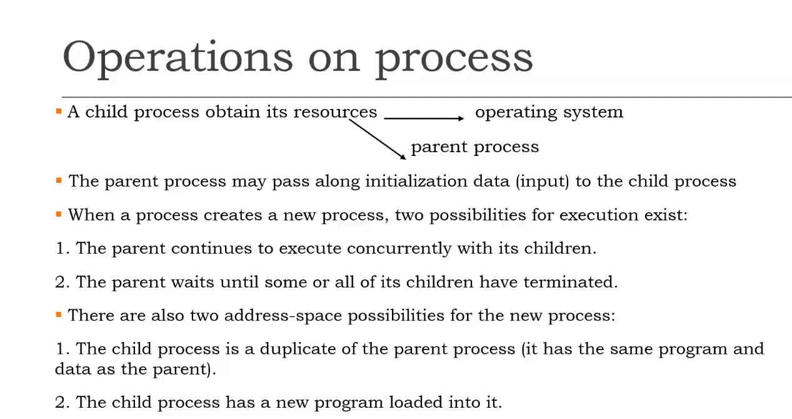

## Operations on process

A child process obtainits resources 
-> OS
-> parent process

Case study:  UNIX OS

- a new process is created by the fork() system call

- Both process (the parent and the client) continues execution at the instruction after the fork()

- fork() takes no parameters and returns an interger value

- Below are different values returned by fork()

1. successful

Zero: Returned to the newly created child process

Positive value: Returned to parent or caller. The value contains process ID of newly creaeted child process.

2. Unsuccessful

Negative value: creation of a child process was unsuccessful

