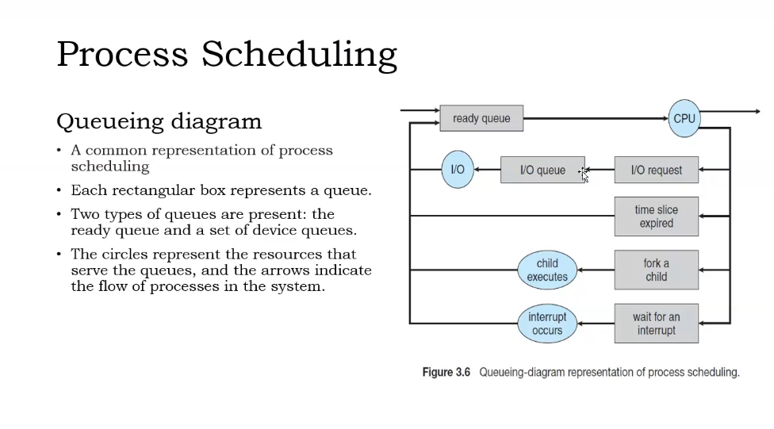
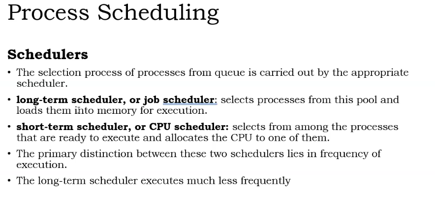
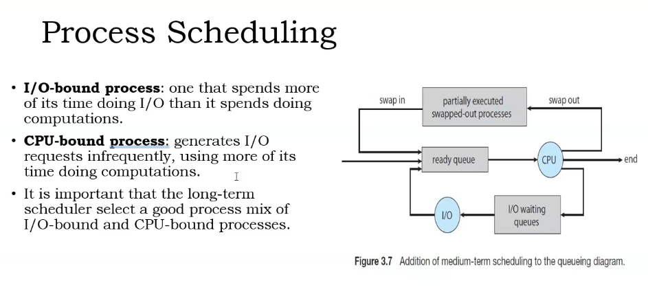
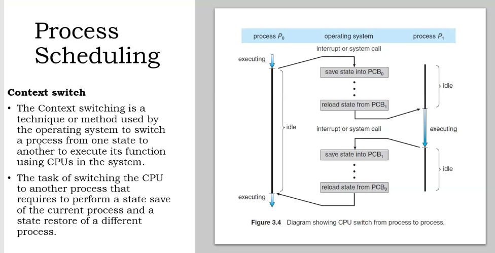
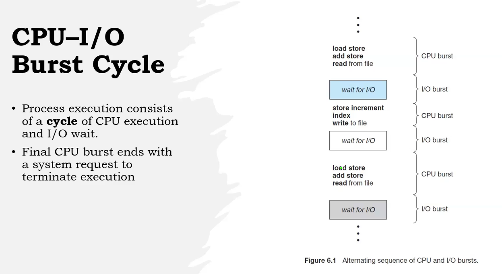
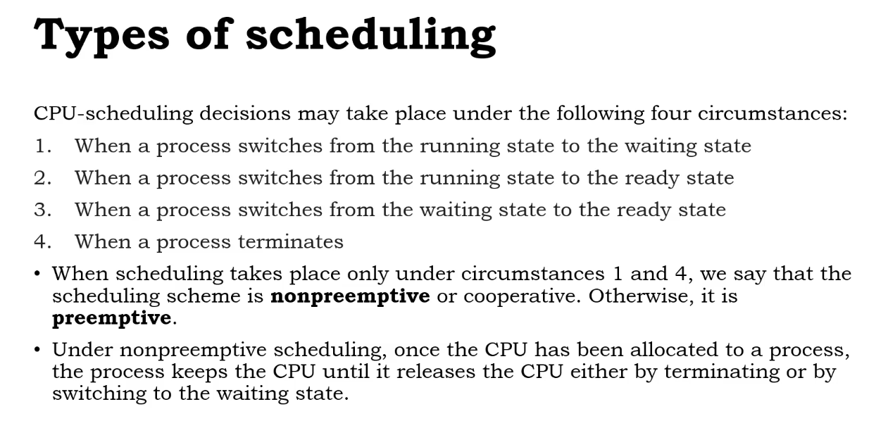
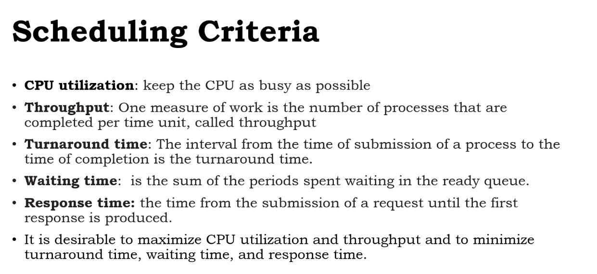
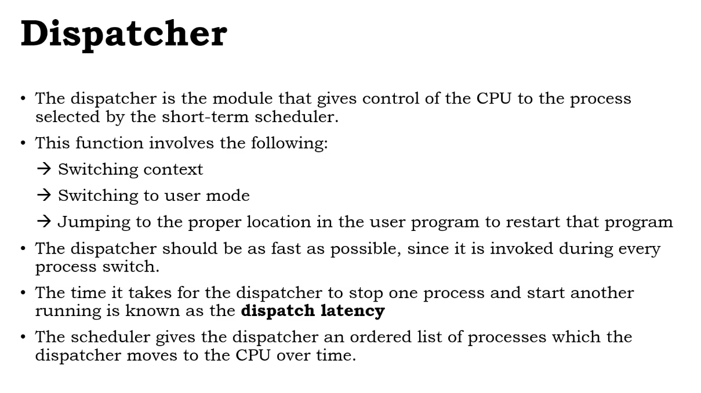

# Process scheduling
The process scheduling is the activity of the process scheduler that handles the removal of the running process from the CPU and the selection of another process on thebasis of a particular strategy.

Process scheduling is a essential part of a multiprogramming and time sharing operating systems.

## Scheduling Queses
- As processes enter the system, they are put into a job queue , which consists of all processes in the system.

- the processes that are resisding in main memory and are ready aand waiting to execute are kept on a list called the `ready queue`.

- ready queue is generally stored as a linked list.

- The list of processes waiting for a particular I/O device is called a `device queue`.

### CPU -I/O Burst Cycle

- Process execution consists of A cycle of CPU execution and I/O wait.

- Final CPU Burst ends with a system request to terminate execution.

