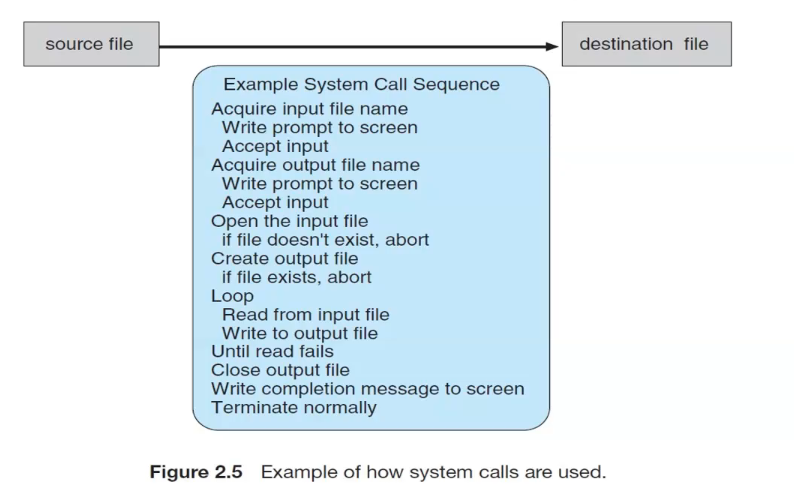

# System Calls [exp:3]
----
provide an interface to the services made availabel by an operating system

_copy contents form source to dest file_

The system call interface intercepts function calls in the API and invokes the necessary system calls within the operating system.

...

Three general methods are used to pass parameters to the OS

1. pass the parameters in the registers

2. parameters are stored in a block, or table, in memory , and the address of the block is passed as a parameter in a register

3. Parameters also can be placed, or pushed, onto the stack by the program and popped off the stack by the OS

## Types o fSystem calls
1. process control

2. File manipulation

3. Device manipulation

4. information maintenance

5. Communications

6. Protection 

### 1. Process control
a running program needs to be able to halt its execution either normally or abormally

a process ot job executing one program may want o load and execute another program.

to create a process

To detemine and reset the attributes of a job or process, including the job's priority, its  maximum allowable execution time,etc.

to terminate a job or process that we created 

to wait  for a new process to finish

to wait for a specific event to occur

to signal the process that the event has occurred 

to ensure the intergrity of the data being shared

### attributes
- process id

- job priority

- allowable time

- program counter

### types
- create the process

- loading and executing a program

- reset the attributes of a job

###  Summery
- end, abort

- load, execute

- creaet process , terminate process

- get process attributes, set process attributes

- wait for time

- wait event, signal event

- acquire lock,release lock

- allocate and free memory

diff in syntax calls
---

windows | Linux
--------|------
CreateProcess() | fork()
ExitProcess() | exit()
WaitForSignalObject() | wait()

