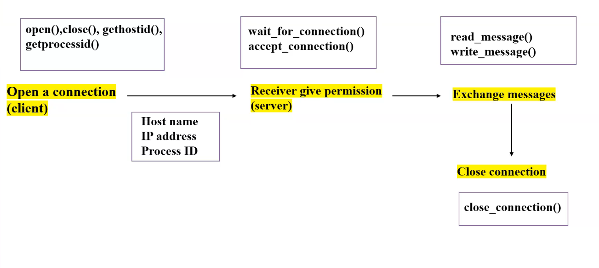

5. Communications

create, delete communication connection

- send, receive messages
- transfer status information
- attach or detach remote devices

types:
- interprocess comm : btw 2 processes
- intraprocess communication: btw a process and a sub-process

Two common models for interprocess comm

- message passing model
- shared-memory model: shared_memory_create(), shared_memory_attach()

### Message passing model

entire process is done by the OS

### Shared memory
> create is used to create 
> attach is used to attach to the shared-memory

after creating and given access the OS has no power, rest is done by process

Windows | Linux
--------|-----
CreatePipe() | pipe()
CreateFileMapping() | shm_open()
MapViewOfFile() | mmap()

pipe() -interprocess- pass memory/data

shm_open() [shared memory]- mapping a content of file to mem addr

mmap() - map to shared mem area

6. Protection

- File security
- manipulate the permission setting of resources such as files and disks
-speicfy whether particular users can be allowed access to certain resources

Windows | Linux
---|---
SetFileSecurity() | chmod()
InitializeSecurityDescriptor() | umask()
SetSecurityDescriptorGroup() | chown()

chown() - change group permission

