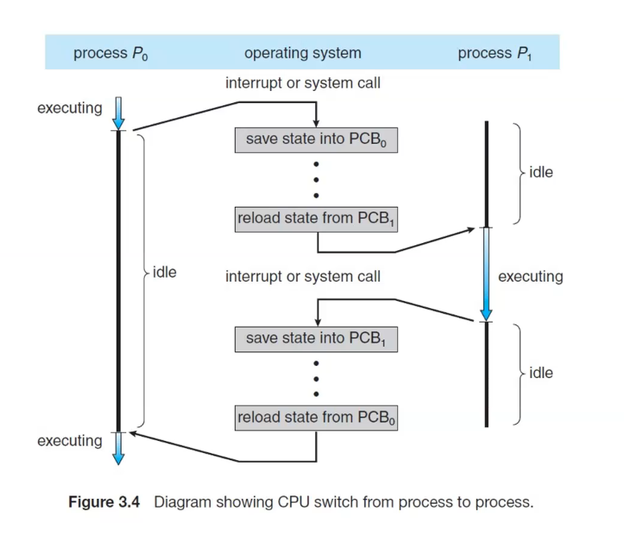

## Process Control Block (PCB) 

Represents each process in the system

Each process will have a PCB

to keep track of the process

- Process state: state of the process(eg: new, ready, waiting, running, terminated)

- Process Number: unique identifier of the process

- Program Counter:The counter indicates the addr of the next instruction to be executed for this process

- CPU registers: The registers vary in number and type depending on the computer architecture.

- Cpu-scheduling info: This info includes a process priority , pointers to  scheduling queues,etc

- Memory-management info: This info may incllude such items as the value of the base and limit registers and the page tables or the segmaent tables, depending on the memory system used by the OS

- Accounting info: inlcudes the amount of CPu and real time used, time limits, 

- I/O status info: list of i/o devices allocated to the process 

