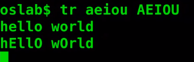

terminal or shell
----------
Bash 
csh
zsh
ksh
sh

## commands are used to interact with the  shell
```
ls - list directories and files
	ls -l [long list format]
```

```
mkdir - make directories
```

```
cd - change directories
	cd .. [one directory back]
	cd / [go to root directory]
	cd ~ [go to home directory]
```

```
pwd  - present working directory
```

```
clear - clear the screan
```

```
cat - concatinate [view the contents of a file]
```

```
nano,vi,emacs - text editor
```

```
man - manual [helps to find the use of commands]
```

```
echo - print to the screen
```

```
tr - translate or delete chars

ctrl+d - to exit
```



```
whereis - location of command/bin
```

```
file - determine file type
```

```
history - list of command used
```

```
wc - [wordcount] prints the numbr of lines,words,chars/bytes
```

```
| - pipe symbol [pass output from one as input to another]
```

```
tee - read from standard input and write to standard output
```

```
chmod - change modification
	r = read 4, 
	w = write 2, 
	x = execution 1
	chmod -x [remove execution permission]
	chmod +x [add execution permission]
```


Redirect

> output redirect

```
> - redirect

>> - redirect[append to file/no rewrite]
```

> input redirect
```
< - read from file
```

```
ps -process status
	ps -el [long list format]
```

```
pstree - shows process in heirarchical structure
	root - systemd,init
	kthreadd - parent of all kernel
```

## Sys calls
Functions for using kernel mode

[Fork](https://www.youtube.com/watch?v=4aH8Hl7q54c)
```
fork() - to create a new process[new process- child process]
	child process returns - 0
	parent returns - +ve pid
	error - -ve value
```

[Exec](https://www.youtube.com/watch?v=lifI5hBPAy4)
```
exec() - to execute binaries/executable files
	execl("/usr/bin/ls","ls","-l",NULL) [execl is one form of exec]
```
> The first parameter of each function denotes the pathname of the file to be executed.A variable number of additional parameters. Each points to a string describing a command-line argument for the new program.

```
getpid() - gets  the process id[+ve if there is no error | not zero for child]
```

[Exit, Wait](https://www.youtube.com/watch?v=sHuOKogSd6s)
```
exit() - exit the process
```
 
```
wait() >>- blocks the calling process until one of its child processes exits or a signal is received. A zombie process or defunct process is a process that has completed execution but still has an entry in the process table

```

```
close() - 
```

[Stat](https://www.youtube.com/watch?v=FXaaN3fxDU4)
```
stat() - status/state
```

[Opendir, Readdir](https://www.youtube.com/watch?v=ETV_rzainOc)
```
opendir() - open directory
```

```
readdir() - read contents of directories
```

```
open("file.txt",arg2 [ ,mode ] ) -open, read, write and possibly create a file
	arg2 	 | use
	-------- | ---
	O_CREAT  | create a regular file
	O_APPEND | open a file in append mode
	O_RDONLY | open file for reading only
	O_WRONLY | open file for writing only
	O_RDWR 	 | open file for both read and write

	mode 	| use
	------- | ---
	S_IRWXU | 00700 user has read,write and execute permission
	S_IRUSR | 00400 user has read perm
	S_IWUSR | 00200 user has write perm
	S_IXUSR | 00100 user has execute perm
	S_IRWXG | 00070 group has read, write and execute perm
	...	| ...

	returns +ve int on success
	0 - std in
	1 - std out
	2 - std err
```

```
write - write to a file descriptor
```

```
read - read from a file descriptor
```

```
lseek(int fd, off_t offset, int whence) - 
	0 - stdin
	1 - stdoout
	2 - stderr

```
