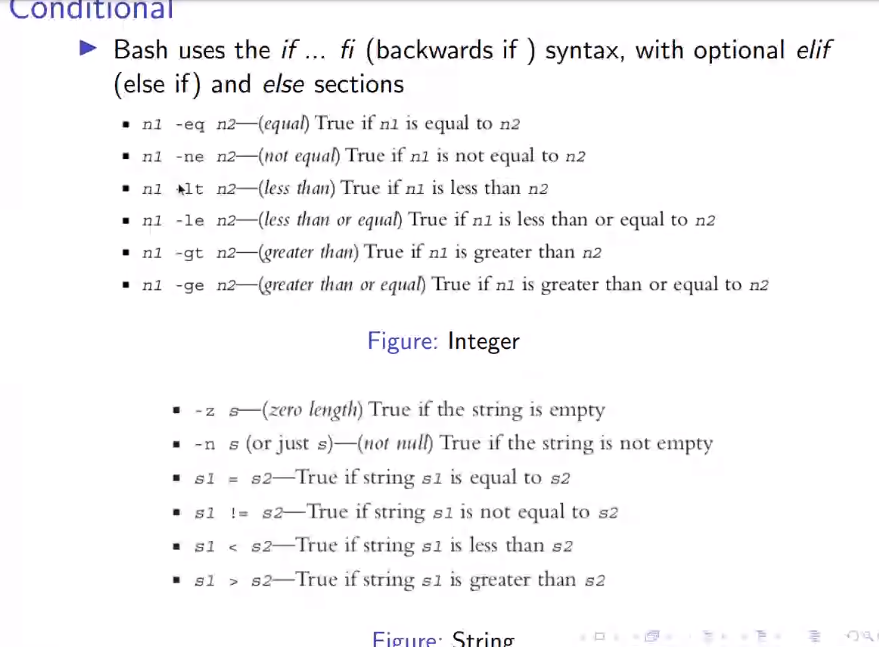

## Intro

- Bash stands for Bourne Again SHell
- Most sh scripts can be run by Bash without modification.
- A variable's name is a string starting with a letter and containing letters, numbers, or underscores
- Putting spaces around the equal sign will cause errors

### executing a file

- Create a file `test.sh`
-add
```
echo "hello world"
```
-run `bash test.sh`

## sh commands
> use echo to print the commands
### variables
```
var=2021  
var1="Fisat"
sem="4"  - create a variable
	never add space | its an error
```
> echo $sem - use $ to take the value

### quotes

var=5

echo "$var" is same as $var

echo '$var' 

> prints `$var` instead of 5

### command line arg
var1=$1

var2=$2

> adding

((var3=var1+1))

((var4=var2+2))

echo $var1

echo $var2


> call `bash test.sh 10 32`

### conditional


#### if
```
var1=$1
var2=$2

if [[ $var2 -gt $var1 ]]
then
	echo "$var2 greater than $var"
else
	echo "$var2 lesser than $var"
fi
```
> fi - tells that the if is done
> can use `if((var2>var1))` also
#### for 
```
sum=0
for((i=0;i<10;i++))
do
	((sum=sum+i))
done
echo $sum
```

#### while

```
sum=0
i=0
while((i<10))
do
	((sum=sum+i))
	((i=i+1))
done
echo $sum
```

#### File Handling

```
if[[ -e "echoooo.png" ]]
then
	echo "File exists"
else
	echo "No file"
fi
```

```
while read line
do
	echo  $line
done<"test.txt"
```

```
grep - find the word
```
> eg: `grep "hello" test.txt` find the hello from test.txt
```
grep "hello" test.txt

grep -i "hello" test.txt #case insensitive

grep -i "\<hello\>" test.txt #only ` hello ` space after and before
```

